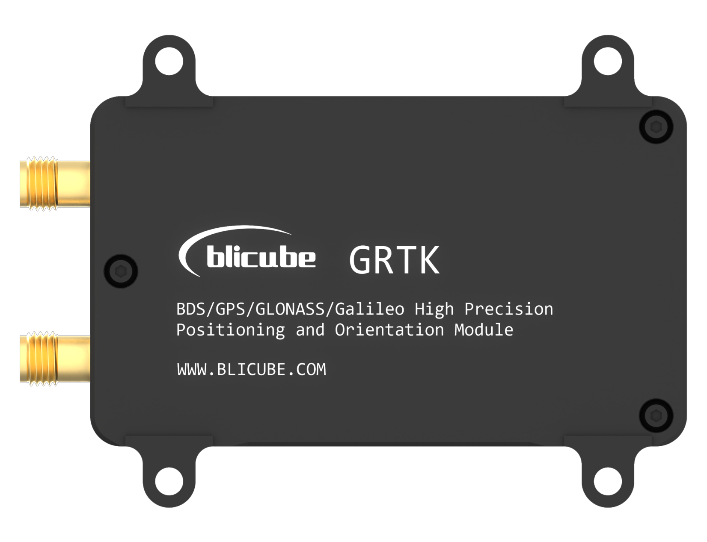
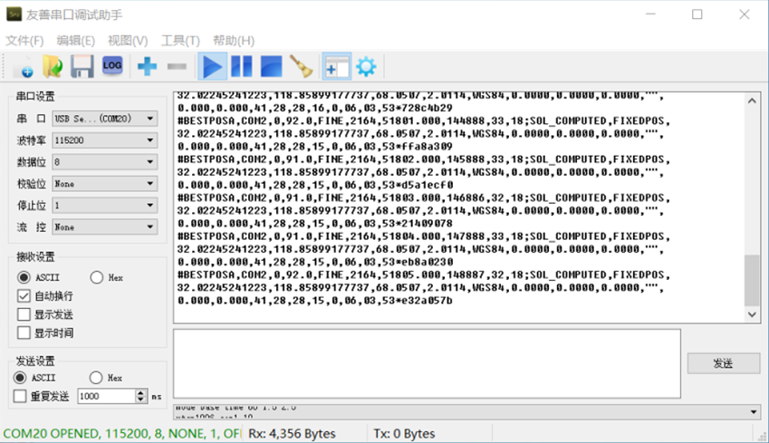
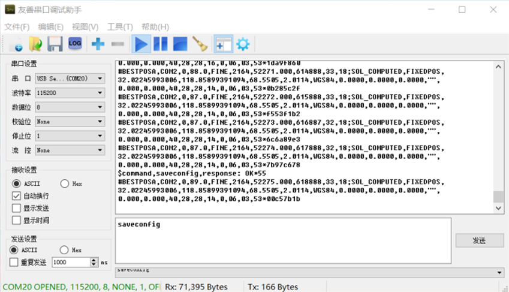
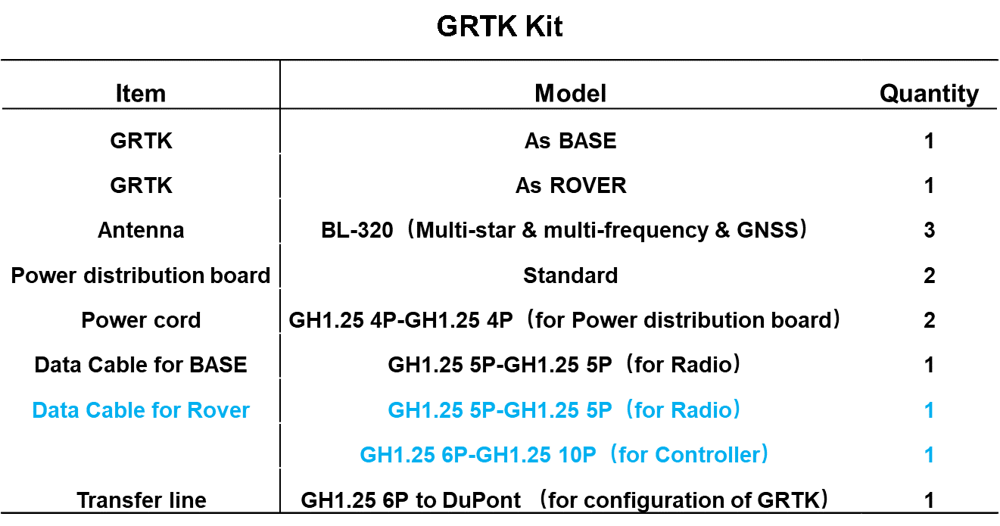
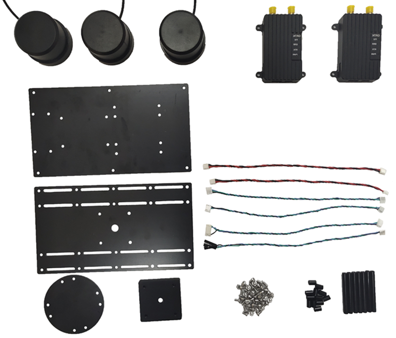

# GRTK User Manual


**Revision History:**

| Version | Data       | Author    | Describe                                                                                                  |
|---------|------------|-----------|-----------------------------------------------------------------------------------------------------------|
| V1.0    | 2021/05/04 | Qingchuan | Original version                                                                                          |
| V1.1    | 2021/07/08 | Qingchuan | Modify pictures of GRTK shell                                                                             |
| V1.2    | 2021/07/14 | Qingchuan | Add several mode of Base                                                                                  |
| V2.0    | 2021/10/28 | Alan      | Add English version                                                                                       |
| V2.1    | 2022/4/5   | Alan      | Add work mode of Base station; Update pictures; Change output rate to 5Hz after discussing with Ardupilot |
|         |            |           |                                                                                                           |
                                                                                                       |

**Statement:**

The user using the GRTK centimeter-level positioning module is deemed to have automatically accepted this statement.

Please read this manual carefully before using the GRTK centimeter-level positioning module. If you have any questions you don't understand, please contact our technical support email [**blicube.sp@gmail.com**](mailto:blicube.sp@gmail.com).

If you are interested with GRTK, welcome to join [GRTK Discord Community](https://discord.gg/jVh6NnVS7C) to give us feedback.


## Part 1 System Introduction

### 1.1 Introduction

GRTK is a dual-antenna high-precision differential positioning and directional module (Real Time Kinematics) independently developed by **Blicube**. A complete RTK system can be formed through two GRTK modules (one mobile terminal and one base station terminal).

The module is based on a new generation of high-performance GNSS SoC chip design, supports multi-system multi-frequency RTK positioning, supports dual-antenna high-precision orientation, and supports GPS, GLONASS, Beidou, Galileo&QZSS navigation and positioning. It is mainly for high-precision positioning and orientation requirements such as drones, robots and intelligent driving.


****

<center>
Figure 1.1 Physical image of GRTK centimeter-level positioning and orientation system
</center>


## 1.2 Parameters

-   **Performance**

| Item                           |                                                                        |
|--------------------------------|------------------------------------------------------------------------|
| Frequencies                    | BDS B1I/B2I1<br> GPS L1/L2 <br/>GLONASS L1/L2<br> Galileo E1/E5b<br> QZSS L1/L2 |
| Single Point Positioning (RMS) | Horizontal：1.5m<br> Vertical：2.5m                                      |
| DGPS (RMS)                     | Horizontal：0.4m<br> Vertical：0.8m                                      |
| RTK (RMS)                      | Horizontal：1cm+1ppm<br> Vertical：1.5cm+1ppm                            |
| Heading Accuracy (RMS)         | 0.2 degree/1 m baseline                                                |
| Velocity Accuracy (RMS)        | 0.03 m/s                                                               |
| Time Accuracy (RMS)            | 20 ns                                                                  |
| Time to First Fix (TTFF)       | Cold start < 25 s                                                      |
| Initialization Time            | < 5s (typical)                                                         |
| Reacquisition                  | < 1 s                                                                  |
| Correction                     | RTCM v2.3/3.0/3.2                                                      |
| Data Output                    | NMEA-0183                                                              |
| Update Rate                    | 20 Hz                                                                  |
| Inertial Navigation Accuracy   | < 5% of distance travelled during GPS denied conditions                |
| Working Temperature            | -20℃ to +85℃                                                           |
| Power Supply                   | 5v to 35v      
| Power Dissipation              | ~2.5W

-   **Physical size**

****

<center>
Figure 1.2 Schematic diagram of physical size
</center>

## Part 2 Usage

### 2.1 Interfaces

The GRTK module can be used as a base station or as a mobile station. There are three interfaces in total, as shown in Figure 2.1. They are the Power port for powering the device, the com1 port for communication between the mobile station and the base station, and the com2 port for communicating with the flight controller to transmit positioning information. The com2 port includes uart2 and uart3, and the default use of uart2 is the serial port of flight control communication.


<center>
Figure 2.1 GRTK module interfaces diagram
</center>

In addition, there are four LED indicators on the front of the module. The three on the left display the module's operating status, which are 3D Fix positioning status, operating error, and RTK positioning status; a single indicator on the right is used to display the power supply status.

The GRTK module supports dual-antenna heading, and the antenna named **ANT1** is the master antenna, the antenna named **ANT2** is the slave antenna, and the single antenna needs to be connected to the master antenna.

### 2.2 Hardware connection

-   **Base station connection**


<center>
Figure 2.2 Base station connection diagram
</center>


<center>
Figure 2.3 Schematic diagram of base station tripod installation
</center>

-   **Rover connection**


<center>
Figure 2.4 Rover connection diagram
</center>

-   **Dual-antenna rover connection**

****

<center>
Figure 2.5 Dual antenna rover connection diagram
</center>

When the base station is not used, only the rover can be used as a conventional positioning device for positioning. The connection is shown in Figure 2.3.

The base station and the rover can be used together to form an RTK centimeter-level positioning system, and the base station supports plug and play.

The dual-antenna direction finding of the rover needs to keep the master-slave antenna consistent with the heading in accordance with the master-back-and-forward. The distance between the master-slave antennas should be greater than 30cm to ensure the direction finding accuracy.

### 2.3 Indicator light & Positioning status

There are 4 indicators on the GRTK module, the specific meanings are shown in the table below:

| **Light** | **Status** | **Describe**                                   |
|-----------|------------|------------------------------------------------|
| FIX       | On         | Enter 3D Fixed state.                          |
|           | Off        | Not in 3D Fixed state.                         |
| ERR       | On         | Error! The module does not work properly.      |
|           | Off        | No error has occurred and is working properly. |
| RTK       | On         | Enter RTK Fixed state.                         |
|           | Off        | Not in RTK Fixed state.                        |
| PWR       | On         | The power supply is OK.                        |
|           | Off        | The power supply is abnormal.                  |

-   **When the Base is working properly, the status light changes：**

> PWR and FIX are on，the other lights are off.

-   **When the Rover is working properly, there are two conditions in which the status light changes:**
>  PWR and FIX are on，the other lights are off, that means Rover has been in 3D Fixed state.<br>
>  PWR, FIX and RTK are on, the other lights are off, that means Rover has been in RTK Fixed state.

### 2.4 Positioning data description

The GRTK module outputs NMEA protocol positioning data by default, connects computer with GRTK module’s Tx2 and Rx2 by USB-to-TTL module, then you can use the serial assistant to read or configure the output message.

GRTK Rover and Base are factory configured, non-professionals do not configure equipment please. **PS: Please set the line break to CR&LF.**

#### 2.4.1 Rover with a single antenna

> $GPGGA: Global positioning system fix data<br>
> $GPRMC: Recommended minimum data<br>
> $GPHDT: Output current heading information<br>
> $KSXT: Time, positioning and heading of GNSS receiver


-   **Other messages**

    If needed, you can send ASCII syntax by serial port to configurate it：

 >  Configuration Format: GPXXX COMX XX（message + output port + output rate）
 >  SAVECONFIG（Save configuration）


-   **Reset**

    If output message is inconsistent with the factory during use, the output can be reset by following commands:

```html
FRESET
GPGGA COM2 0.2  
GPRMC COM2 0.2  
GPHDT COM2 0.2  
KSXT COM2 0.2
SAVECONFIG
(CR&LF)
```

#### 2.4.2 Rover with dual antennas for heading

- **Output messages at 5Hz by factory default:**

> $GPGGA: Global positioning system fix data<br>
> $GPRMC: Recommended minimum data<br>
> $GPHDT: Output current heading information<br>
> $KSXT: Time, positioning and heading of GNSS receiver

-   **Other messages**

    If needed, you can send ASCII syntax by serial port to configurate it：

```html
FRESET
GPGGA COM2 0.2  
GPRMC COM2 0.2  
GPHDT COM2 0.2  
KSXT COM2 0.2
SAVECONFIG
(CR&LF)
```

 >  Configuration Format: GPXXX COMX XX（message + output port + output rate）
 >  SAVECONFIG（Save configuration）
  
-   **Reset**

    If output message is inconsistent with the factory during use, the output can be reset by following commands:

## Part 3 Guidance for Use

The current version of the GRTK cm positioning system supports the output of NMEA protocol positioning data, the following guidance is based on the Ardupilot firmware(v4.2.0 or higher) using the Mission Planer ground station.

### 3.1 Connection for modules

-   Have the hardware, including Pixhawk controller, GRTK, radio, battery, etc, shown in Figure 3.1 ready for connection before wiring:


<center>
Figure 3.1 Hardware physical diagram
</center>

-   Rover Base and data transmissions need to be supplied separately.

### 3.2 The communication mode between Rover and Base

GRTK can achieve RTK positioning by communicating through independent links between the base station and the rover station or by forwarding the base station data by the ground station.

- **Independent link**<br>
  a.Please connect the COM2 port of the GRTK Rover to the GPS port of Pixhawk and the com1 port to connect the data transmission device that communicates with the Base sideb) Please connect the GRTK Base com1 port to the computer through the serial port<br>
  b.Connect antenna to the GRTK Base and connect the com1 port of the base side to the data transmission device that communicates with the Rover terminal.<br>
  - **Forwarding the base station data by the ground station**<br>
  a.Please connect the COM2 port of the GRTK Rover to the GPS port of Pixhawk.<br>
  b.Connect the GRTK Base com1 port to the computer through the serial port. <br>
  c.Open **Mission Planner**, find the **Optional Hardware** at the **Initial Setup**, and select **RTK/GPS Inject**.


  d.Choose the correct com port and click **Connect**.<br>


  e.Wait for about one minute for Base to complete the base station positioning, at this time the red in the RTCM column turns green, and the latitude and longitude information of the current base station is displayed, that is, the ground station has been realized to forward the Base positioning data<br>


### 3.3 Mission Planner settings

GRTK Base supports plug-and-play and does not require additional setup at the ground station. However, before actually using RTK, you need to set the parameters for flight control in MP, and the necessary parameter settings are given below, which can be referred to as follows:

```html
https://ardupilot.org/copter/docs/common-gps-for-yaw.html
```

-   Configure the GPS protocol as NMEA and set the GPS data refresh rate to 5Hz.

> - **GPS_TYPE** is set to **5** to configure the GPS protocol as NMEA.
> - **GPS_RATE_MS** is set to **200ms** which means the GPS data refresh rate is 5Hz.

- Set GRTK as the source of yaw

> - **EK3_SRC1_YAW** is set to **2** to set gps as the source of yaw.
> - **COMPASS_ENABLE** is set to **0** to disable compass **if needed**.

### 3.4 Positioning testing

-   Quickly deployed within 30s.

<center>
<iframe width="560" height="315" src="//player.bilibili.com/player.html?aid=546142968&bvid=BV1Kq4y1L7W8&cid=355912464&page=1" scrolling="no" border="0" frameborder="no" framespacing="0" allowfullscreen="true"> </iframe>
</center>

-   Unmanned vehicle automatic route mission measurement.

<center>
<iframe width="560" height="315" src="https://www.youtube.com/embed/vlFBtBZZLb4" title="YouTube video player" frameborder="0" allow="accelerometer; autoplay; clipboard-write; encrypted-media; gyroscope; picture-in-picture" allowfullscreen></iframe>
</center>

## Part 4 Modes of Base Station

GRTK Base has two modes of operation，self-optimizing base station and fixed base station.

-   **Self-optimizing base station：**When it is not clear exactly where the base station will be located, Base will position itself and average itself for a certain period of time after installation as the coordinates of the base station.
-   **Fixed base station:** When know the exact coordinates of the base station location will be set up, you need to enter that exact coordinate into the base station.

### 4.1 Self-optimizing base station

-   Base station default operating mode is self-optimizing base station. Using USB to TTL module to connect the base station serial 2 (Rx2&Tx2) to the computer, the computer runs serial debugging assistant, open the corresponding serial port with the baud rate of 115200. The base station returns the current location information.



-   Send the following command (PS: Commands need to end with a line break) to base station by serial to complete configuration.


-   **mode base time 60 1.5 2.5**

    Within 60-second automatic positioning of the base station, or when the standard deviation of horizontal positioning is no more than 1.5 m and that of vertical positioning is no more than 2.5 m, set the average value of horizontal and vertical positioning results as the base station coordinates. Restarting the base station triggers a new calculation and reposition of the datum coordinates. Users can modify parameters according to their needs.

-   After configuration, send the following command (PS: Commands need to end with a line break) to base station by serial to save configuration.
-   **saveconfig**



### 4.2 Fixed base station

Fixed base station mode configuration is divided into two steps, the first step is to obtain the current exact coordinates, the second step is to enter the base station's precise coordinates into the base station.

**Step1: Get the current exact coordinates**

Using the USB-to-TTL module to connect the base station serial 2 to the computer, the computer runs the serial debugging assistant, open the corresponding serial port, Baud rate of 115200. The base station returns the current location information.


-   Send the following command (PS: Commands need to end with a line break) to base station by serial to complete configuration.
-   **mode base time 60 1.5 2.5**

    Within 60-second automatic positioning of the base station, or when the standard deviation of horizontal positioning is no more than 1.5 m and that of vertical positioning is no more than 2.5 m, set the average value of horizontal and vertical positioning results as the base station coordinates. Restarting the base station triggers a new calculation and reposition of the datum coordinates. Users can modify parameters according to their needs.

-   Note that the obtained WGS84 coordinates indicate that the base station initialization is complete when the data is stable.


**Step2: Enter the exact coordinates of the base station into the base station**

-   Copy the location information of the base station output

**Example:**
```html
#BESTPOSA,COM2,0,91.0,FINE,2164,52077.000,420887,32,18;SOL_COMPUTED,FIXEDPOS,32.02245993006,118.85899391094,68.5505,2.0115,WGS84,0.0000,0.0000,0.0000,"",0.000,0.000,40,28,28,16,0,06,03,53\*17b29c25
```


- Analyze and get longitude, latitude and elevation data


**Please replace it with the actual measurement data**
```html
32.02245993006,118.85899391094,68.5505
```

-   The configuration command is generated based on the exact coordinates of the base station

```
mode base 32.02245993006 118.85899391094 68.5505
```

Send the configuration command (note that the command needs to end with a line break) to the base station through a serial port.

****

-   When the configuration is complete, the following command (note that they need to end with a line break) is sent to the base station through a serial port to save the configuration.

```html
saveconfig
- ```


## Part 5 Precautions

-   With our GRTK Kit, the base station side supports plug-and-play. If only Rover is purchased, the use of other companies' base station end requires additional RTK base station configuration at the ground station, which does not guarantee compatibility and positioning accuracy.
-   This product is positioning equipment, which needs to search for satellite positioning, try to test it in the open and undisturbed site.
-   The positioning status of GRTK should be mainly decided by the ground station.

## Part 6 Purchase

### 6.1 Link for purchase

AliExpress: GRTK ([BLI Store](https://blicube.aliexpress.com/store/1101755276?spm=a2g0o.store_pc_home.1000001.12.479750aekabNyg))

### 6.2 List





### 6.3 Express delivery

Appropriate logistics methods need to be adopted according to the actual situation.

### 6.4 Wholesale

Wholesale prices vary depending on the quantity of the wholesale, please email us([**blicube.sp@gmail.com**](mailto:blicube.sp@gmail.com)) for more details.


