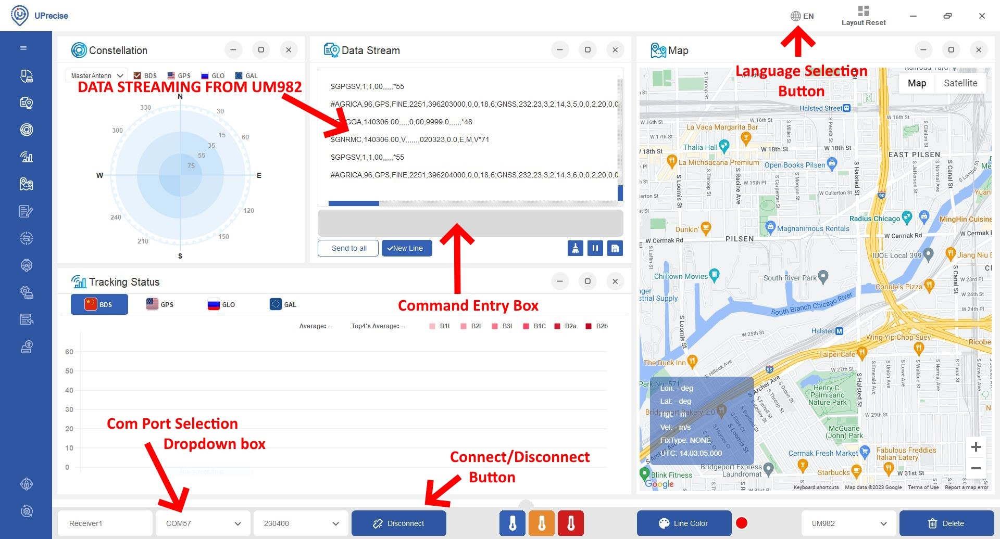

# How to Use Uprecise to show position and heading on map?

!!! Warning "Please do not reconfig the settings for GRTK if not necessary!"

!!! Info "Download, install and run the application"
    [Unicore Uprecise](en.unicorecomm.com/assets/upload/file/UPrecise%20V1.0.639.exe)

!!! Info "Conect COM1 of GRTK Rover to PC's port by USB-to-TTL"
    * Select the correct port 
    * Select the default baudrate-115200
    * Connect
    * And the data stream, position and heading... will be showed in the window

{ width="1000" }
