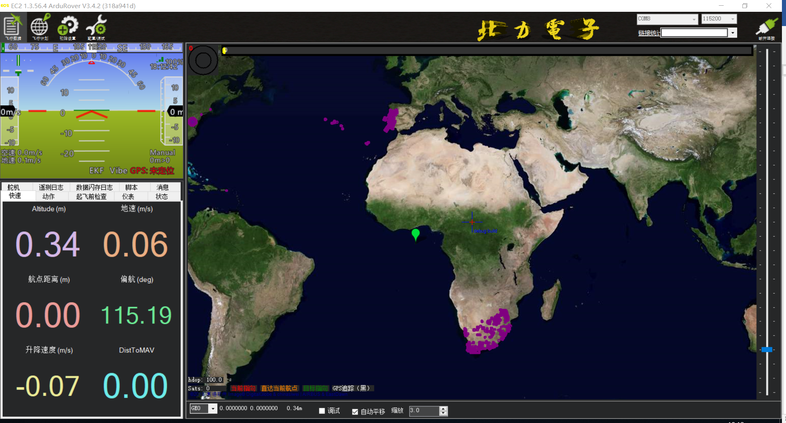
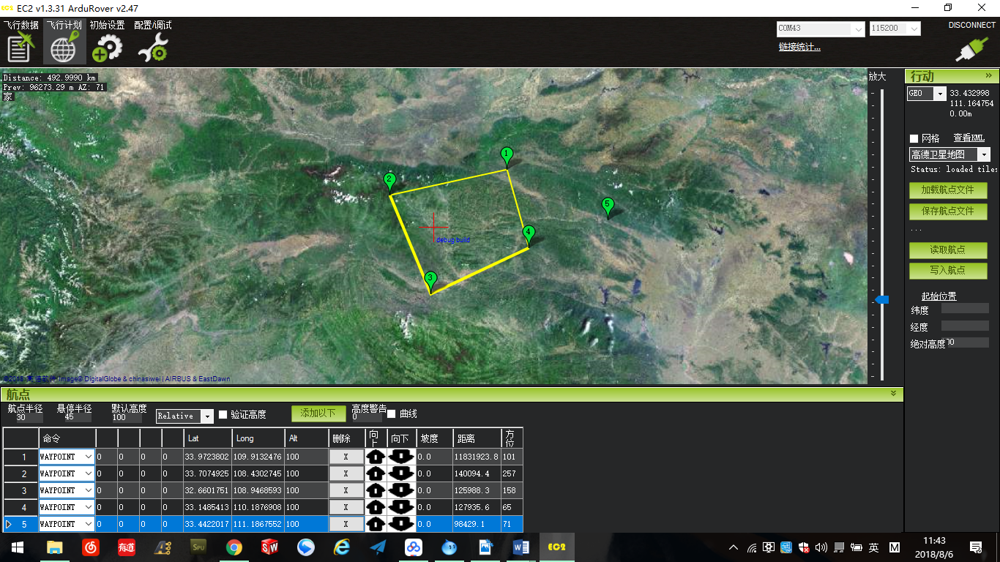

# AutoRover-H3使用说明

AutoRover-H3是北力电子（blicube）提供的基于开源飞控pixhawk的自动驾驶学习平台，支持PX4和Ardupilot固件。
默认出厂使用Ardupilot固件调校，以下教程也基于Ardupilot + Mission Planner来进行使用说明。

## 产品清单

| 型号  |内容物|
|-----| ------|
| 标准  |自动驾驶小车一台(含自动驾驶仪、GPS接收器、无线数传） 动力电池一块  充电器一个  遥控器一套|

## 产品参数

| 参数   | 描述           |
|------|--------------|
| 车架类型 | 多连杆独立悬挂 油压避震 |
| 车架尺寸 | 55cm × 30cm  |
| 车架重量 | 2.5KG        |
| 驱动方式 | 双差速四驱 舵机转向 |
| 驱动速度 | 0～10米/秒 |
| 遥控方式 | 2.4G遥控 |
| 无线数传 | 433Mhz/915Mhz |
| 电池容量 | 11.1V 5200mAh |
| 通信协议 | MAVLink |

## 遥控使用

****

小车有多种驾驶模式，默认为前三种，可以通过地面站软件自定义。

### 停止模式HOLD 

无人车停止，轮子朝前 
正确设置油门参数(RC3_Trim)使小车可以在该模式下停止，单向车约为1000，双向车约为1500

### 手动模式MANUAL 

手动控制油门和方向

### 自动模式AUTO 

按照地面站生成的航线数据自动巡航，完成任务后进入HOLD模式；该模式下拨回MANUAL模式可以获得手动控制权； 

## 自动驾驶

### Mission Planner 地面站

****

主界面左上方为四个主菜单按钮，飞行数据实时显示姿态与数据；飞行计划是任务规划菜单；初始设置用于固件的安装与升级以及一些基本设置；配置/调试包含了详尽的PID调节，参数调整等菜单。主界面右上方是**端口选择**、**波特率**以及 **连接/断开按钮（connect/disconnect）**。

### 航线规划

****

通过无线数传连接小车，波特率为57600，选择飞行计划。这里是做航线规划，不同的命令，可以实现不同的功能，最常用的就是waypoint 航点命令。 
Waypoint 命令，到达航点半径后自动飞向下一航点，其中航点半径也可以自定义，推荐设定为3。设置航点步骤很简单，在地图上单击位置即可添加一个waypoint 航点，并可以单击拖动航点进行移动，完成后点击“写入航点”即可。

## 特别说明
1. 选择一片无人空旷的场地，驾驶前给遥控器和小车充电； 
2. 先打开遥控器，将驾驶模式三段开关拨到“中”位置，即手动模式MANUAL，解锁开关处于锁定状态；
3. 将小车放在水平地面，给小车上电，初始化过程中请勿移动小车。10秒完成初始化，但GPS定位需要更长时间，不影响手动操作； 
4. 等小车初始化完成，打开解锁开关，小车解锁，可以进行手动驾驶； 
5. 使用完毕后，先给小车断电，后关闭遥控器； 
6. 电池没电后请不要继续使用，否则会损坏电池，甚至造成小车失控！！！
