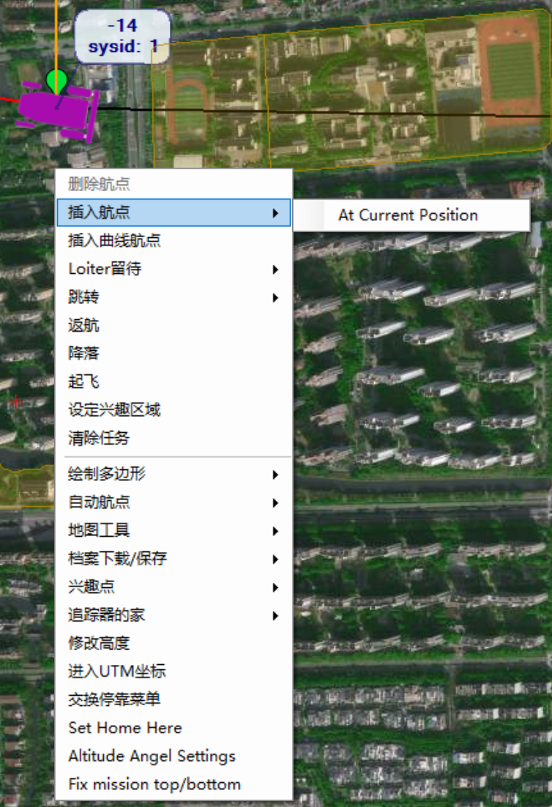
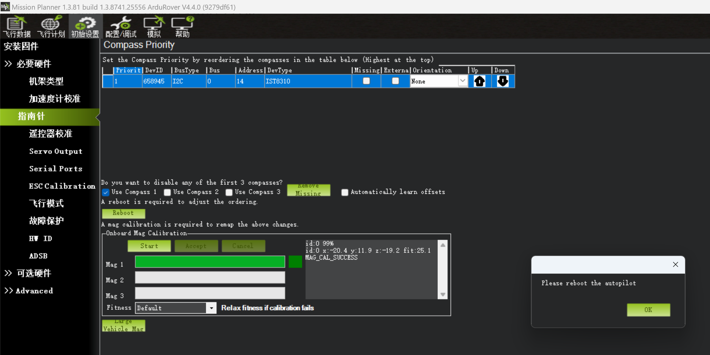
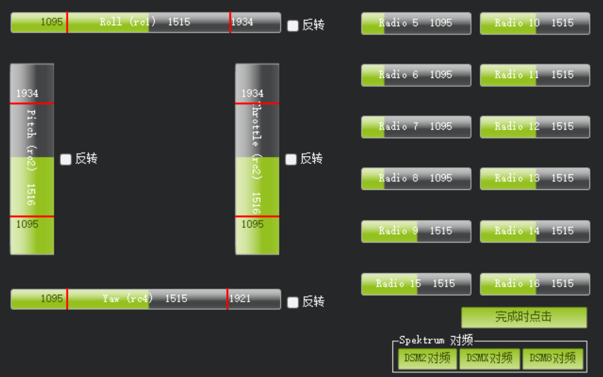
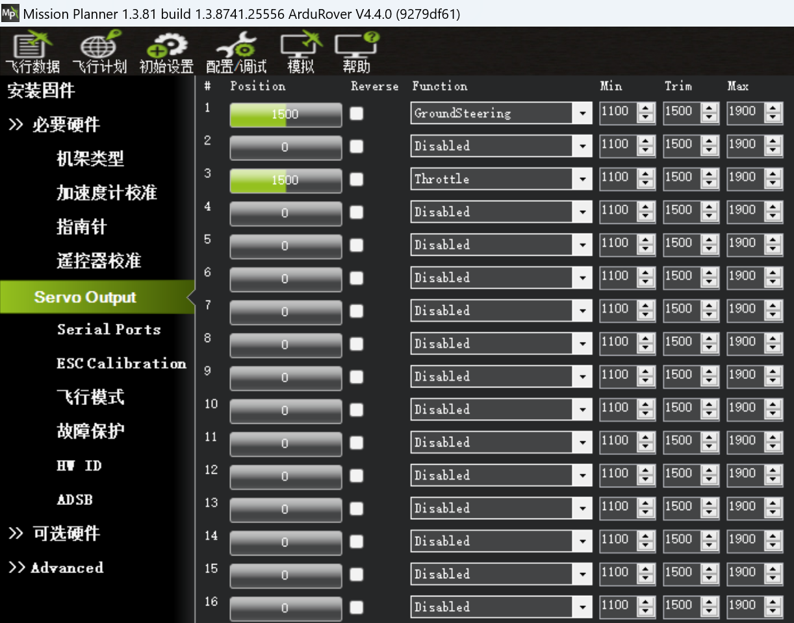

# AutoRover-H3使用说明

AutoRover-H3是北力电子（blicube）提供的基于开源自动驾驶仪pixhawk的自动驾驶学习平台，支持PX4和Ardupilot固件。
默认出厂使用Ardupilot固件调校，以下教程也基于Ardupilot + Mission Planner来进行使用说明。

## 产品清单

|名称|数量|
|---|---|
|车架|1辆|
|动力电池|1块|
|充电器|1个|
|遥控器|1个|
|P900数传|1对|
|P840数传|1对|
|GRTK|1对|
|GRTK天线|3个|

## 产品参数

|项目|参数|
|--|--|
|车架|多连杆独立悬挂，油压避震|
|尺寸|55cm × 32cm|	
|自重|2.5KG|	
|驱动方式|四驱， 舵机转向|	
|速度|0～10米/秒|	
|电池|7.4V 5200mAh|	
|遥控方式|2.4G遥控|
|无线数传|433Mhz/915Mhz|
|通信协议|MAVLink|

## 使用说明

### 地面站使用

主界面左上方主要使用的四个主菜单按钮:  
- **飞行数据**实时显示姿态与数据；  
- **飞行计划**是任务规划菜单；  
- **初始设置**用于固件的安装与升级以及一些基本设置；  
- **配置/调试**包含了详尽的PID调节，参数调整等菜单。  

主界面右上方是**端口选择**、**波特率**以及 **连接/断开按钮（connect/disconnect）**。地面站和AutoRover-H3之间进行连接的方式有两种，一种是使用USB连接地面站，另一种是使用无线数传连接地面站。  

- 使用USB连接地面站  
    打开遥控器，使用USB线连接控制板到电脑，确保电脑已经识别到控制板的COM口后，打开地面站，在地面站主界面的右上方端口选择下拉框那里选择对应的 COM 口，然后波特率选择 115200，点击连接按钮。

- 使用无线数传连接地面站  
    打开遥控器，将带USB口的无线数传地面端插入电脑，确保电脑已经识别到数传的COM口后，打开地面站，在地面站主界面的右上方端口选择下拉框那里选择对应的 COM口，然后波特率选择 57600(3DR数传)/115200(P840数传)，点击连接按钮。

### 遥控操控

* 遥控器摇杆功能说明

AutoRover-H3有多种驾驶模式，可以通过地面站软件自定义，默认设置三种：

* [Hold](https://ardupilot.org/rover/docs/hold-mode.html#hold-mode)模式：车辆保持停止，转向和油门均被锁定

* [Manual](https://ardupilot.org/rover/docs/manual-mode.html#manual-mode)模式：通过遥控器手动控制油门和方向

* [Auto](https://ardupilot.org/rover/docs/auto-mode.html#auto-mode)模式：按照地面站生成的航线数据自动巡航，完成任务后进入`HOLD`模式；该模式下拨回`MANUAL`模式可以获得手动控制权。

!!! warning "注意事项"
    1. 驾驶前给遥控器和小车充电，请勿在电池缺电情况下驾驶； 
    2. 选择一片无人空旷的场地，先打开遥控器，将驾驶模式三段开关拨到“中”位置，即手动模式MANUAL，解锁开关处于锁定状态；
    3. 将小车放在水平地面，给小车上电，初始化过程中请勿移动小车。10秒完成初始化，但GPS定位需要更长时间，不影响手动操作； 
    4. 等小车初始化完成，打开解锁开关，小车解锁，可以进行手动驾驶； 
    5. 使用完毕后，先给小车断电，后关闭遥控器； 
    6. 如果使用2S电池，电池电压低于7V后请不要继续使用，否则会损伤电池寿命，严重情况造成电池不可逆的亏电！！！

### 航线规划

[Ardupilot官网文档](https://ardupilot.org/rover/docs/common-mission-planning.html)

* 打开地面站，点击`飞行计划`菜单，在界面右侧的地图选项中下拉选择`高德卫星地图`（需要联网），在国内支持比较好。将小车放置在空旷的户外（有GPS信号），上电后通过无线数传连接到地面站，GPS定位后可以在界面上看到小车的实时位置。通过鼠标和滚轮可以自由的拖动、缩放地图。  
  

* 点击地图上一点，即可生成一个航点，鼠标按住航点拖动即可调整航点位置。  
  

* 依次点击地图上的点，即可生成一系列航点。  

* 除了在地图上点击，点击`在下方添加`按钮即可添加航点，再手动输入航点的经纬度坐标。  

* 还可以将车辆移动到期望的位置，然后在航线编辑界面上右键，点击`插入航点`选择`At Current Position`，即可将车辆当前位置设置为航点。

* 还可以设定一个遥控器通道用于将车辆当前位置设置为航点, 比如`RC7_OPTION` = 7就是将遥控器通道7设置用于该功能，将该通带拨杆从低拨到高，再拨回低，即可完成一个航点的设置。

* 此外，还可以使用AUX Function将车辆当前位置设置为航点。

* 点击删除下的`X`按钮即可删除对应航点。

* 点击`写入航点`按钮即可把航线数据上传到小车，将覆盖小车原有的航线数据。

* 点击`读取航点`按钮可以读取小车上的航线数据，呈现在地图上。  

 
* 在每个航点的地方可以设置不同的任务，自动驾驶仪就会在到达该航点是执行相应的动作。  

## 基础参数设置

!!! Note "提示"
    该部分为使用Ardupilot自动驾驶仪固件的Rover基础功能相关的参数设置，AutoRover-H3在出厂时已经对基础功能进行了完整的设置，如果需要自行重新设置参数，可以参考本节的调参指南。

### 校准

#### 加速度计校准

[Ardupilot官网文档](https://ardupilot.org/rover/docs/common-accelerometer-calibration.html)

* 加速度校准位于地面站的`初始设置`菜单下`必要硬件`中的`加速度校准`选项。

* 点击`校准加速度计`按钮，然后按照文字提示以此将自动驾驶仪**水平**、**左边朝下**、**右边朝下**、**前方朝下**、**前方朝上**、**顶部朝下**放置，注意每次都要保持静止，每次做完动作时点击`完成时点击`按钮，直到提示校准完成。

* 将自动驾驶仪水平放置，点击`校准水平`按钮，完成后点击`完成`按钮。

#### 指南针校准

[Ardupilot官网文档](https://ardupilot.org/rover/docs/common-compass-calibration-in-mission-planner.html)

* 指南针校准位于地面站的`初始设置`菜单下`必要硬件`中的`指南针`选项。 

* 勾选`Use Compass 1`，点击`Start`，开始校准。  
  

* 校准时尽可能均匀地绕自动驾驶仪的x、y、z轴旋转，直到绿色进度条满格，出现`Please reboot the autopilot`提示，点击`OK`重启自动驾驶仪，完成校准。
  

#### 遥控器校准

[Ardupilot官网文档](https://ardupilot.org/rover/docs/common-radio-control-calibration.html)

* 遥控器校准位于地面站的`初始设置`菜单下`必要硬件`中的`遥控器校准`选项。  
  

* 在进行遥控器校准前，先确定自己的遥控器模式，遥控器分为左手油门和右手油门，模式通过[RCMAP_THROTTL](https://ardupilot.org/rover/docs/parameters.html#rcmap-throttle)参数进行设定。 
  ](../media/mp_radio_modech.png)  
  左手油门：RCMAP_THROTTLE = 2  
  右手油门：RCMAP_THROTTLE = 3  

* 点击`校准遥控器`按钮，出现的弹窗都点击`OK`，开始校准。  
  ](../media/mp_radio_cal_start.png)

* 将遥杆、拨杆都尽可能向各个方向拨到最大行程，图中的行程示意图的绿条会随着变化，红色线表示其最大行程量。  
  

* 最大行程捕获完毕后，点击`完成时点击`按钮，完成校准，出现的弹窗都点击`OK`。  
    
  

* 校准完成。

### Servo输出功能设置

[Ardupilot官网文档](https://ardupilot.org/rover/docs/rover-motor-and-servo-configuration.html)

Ardupilot Rover支持阿克曼转向车型、差速转向车型、麦克纳姆轮车型，不同车型的支持就通过所连接的舵机数量和舵机的输出功能来设置。AutoRover-H3默认使用阿克曼转向车型，所以需要设置舵机输出功能。

* 阿克曼转向车型  
  Servo1配置为`GroundSteering`，Servo3配置为`Throttle`。
    
  也可在参数列表中配置：  
  [SERVO1_FUNCTION](https://ardupilot.org/rover/docs/parameters.html#servo1-function) = 26 (GroundSteering)  
  [SERVO3_FUNCTION](https://ardupilot.org/rover/docs/parameters.html#servo3-function) = 70 (Throttle)

* 差速转向车型
  Servo1配置为`Throttle Left`，Servo3配置为`Throttle Right`。
    
  也可在参数列表中配置：  
  [SERVO1_FUNCTION](https://ardupilot.org/rover/docs/parameters.html#servo1-function) = 73 (Throttle Left)   
  [SERVO3_FUNCTION](https://ardupilot.org/rover/docs/parameters.html#servo3-function) = 74 (Throttle Right)

* 麦克纳姆轮车型
  首先配置车型：[FRAME_TYPE](https://ardupilot.org/rover/docs/parameters.html#frame-type) = 1 (四个轮子左右配置), 2 (四个轮子呈X形配置) 或者 3 (四个轮子呈+形配置)  
  Servo1配置为`Motor1`，Servo2配置为`Motor2`，Servo3配置为`Motor3`，Servo4配置为`Motor4`。  
     
  也可在参数列表中配置：  
  [SERVO1_FUNCTION](https://ardupilot.org/rover/docs/parameters.html#servo1-function) = 33 (Motor1)  
  [SERVO3_FUNCTION](https://ardupilot.org/rover/docs/parameters.html#servo2-function) = 34 (Motor2)  
  [SERVO3_FUNCTION](https://ardupilot.org/rover/docs/parameters.html#servo3-function) = 35 (Motor3)  
  [SERVO3_FUNCTION](https://ardupilot.org/rover/docs/parameters.html#servo4-function) = 36 (Motor4)  

### 飞行模式

[Ardupilot官网文档](https://ardupilot.org/rover/docs/common-rc-transmitter-flight-mode-configuration.html)

* 配置飞行模式之前，设置用于切换飞行模式的遥控器通道  
  
  [MODE_CH](https://ardupilot.org/rover/docs/parameters.html#mode-ch) = 5(AutoRover-H3设置5通道切换飞行模式)

* 通过拨动遥控器飞行模式切换通道的拨杆，观察绿色高亮的部分，然后在下拉选项中选择需要的飞行模式。
  

* 点击`保存模式`按钮保存设置。  
    
  AutoRover-H3设置飞行模式1为`Hold`，飞行模式4为`Manual`，飞行模式6为`Auto`。

* [Ardupilot Rover支持的飞行模式](https://ardupilot.org/rover/docs/rover-control-modes.html)

### GRTK相关参数设置

[Ardupilot官网文档](https://ardupilot.org/rover/docs/common-positioning-landing-page.html#rtk-gps)

* 配置GRTK的NMEA协议  
  [GPS_TYPE](https://ardupilot.org/rover/docs/parameters.html#gps-type) = 5  
  [GPS_RATE_MS](https://ardupilot.org/rover/docs/parameters.html#gps-rate-ms)  =  200  
  [SERIAL3_BAUD](https://ardupilot.org/rover/docs/parameters.html#serial3-protocol)  =  115  
  [GPS_AUTO_CONFIG](https://ardupilot.org/rover/docs/parameters.html#gps-auto-config) = 0，Ardupilot Rover4.4及以上需要配置，禁用自动配置GPS串口

* [GRTK航向配置](https://ardupilot.org/rover/docs/common-gps-for-yaw.html)  
  使用双天线测向需启用 GPS 航向:（航向为ANT1指向ANT2）  
  [AHRS_EKF_TYPE](https://ardupilot.org/rover/docs/parameters.html#ahrs-ekf-type) = 3， 选择 EKF3  
  [EK2_ENABLE](https://ardupilot.org/rover/docs/parameters.html#ek2-enable) = 0， 禁用 EKF2  
  [EK3_ENABLE](https://ardupilot.org/rover/docs/parameters.html#ek3-enable) = 1， 启用 EKF3  
  [EK3_SRC1_YAW](https://ardupilot.org/rover/docs/parameters.html#ek3-src1-yaw) = 2， 启用 GPS 航向  

* GRTK天线安装偏移  
  [GPS_POS1_X](https://ardupilot.org/rover/docs/parameters.html#gps-pos1-x) = -0.16
  因为AutoRover-H3的定位天线安装在车体后部（前向为x正），距离车体中心0.16m，所以设置GPS_POS1_X = -0.16。

### 数传参数设置

如果使用3DR的数传，则无需配置，如果使用Rlink P900或P840数传，则需要配置数传参数。如果数传连接到自动驾驶仪的`TELEM1`端口，则需要设置[SERIAL1_BAUD](https://ardupilot.org/rover/docs/parameters.html#serial1-baud) = 115。如果数传连接到自动驾驶仪的`TELEM2`端口，则需要设置[SERIAL2_BAUD](https://ardupilot.org/rover/docs/parameters.html#serial2-baud) = 115

### 解锁设置

[Ardupilot官网文档](https://ardupilot.org/rover/docs/arming-your-rover.html)

* 由于AutoRover-H3默认不适用安全开关，所以将设置禁用安全开关
  关闭检查：[BRD_SAFETY_DEFLT](https://ardupilot.org/rover/docs/parameters.html#brd-safety-deflt) = 0  
  

* 车辆解锁前有会进行多项检查，可配置需要检查的项目
    
  其他更多关于解锁检查的参数请参考[Ardupilot官网文档](https://ardupilot.org/rover/docs/common-prearm-safety-checks.html)

* 车辆有故障保护机制，在飞行数据界面如果提示有故障保护，请检查`消息`选项卡，查看具体故障原因
  
  以上图为例，其中的故障保护信息为`Radio Failsage`，表示遥控器信号丢失，车辆会进入故障保护模式。  
  其他更多的故障保护信息请参考[Ardupilot官网文档](https://ardupilot.org/rover/docs/rover-failsafes.html)

## 高级参数设置

!!! Note "提示"
    该部分为使用Ardupilot自动驾驶仪固件的Rover驾驶相关的参数设置，AutoRover-H3在出厂时已经对驾驶功能进行了完整的设置，如果需要自行重新设置参数，可以参考本节的调参指南。

[Ardupilot官网文档](https://ardupilot.org/rover/docs/rover-tuning-process.html)

### 转向微调

如果在手动模式`MANUAL`下，车辆在方向舵处于中立位置时无法直线行驶，可以选择调整方向舵的机械结构来纠正，或者使用`RCx_OPTION` = 5（Save Trim）来纠正。在在遥控器校准完成后，不建议使用遥控器的方向微调按钮，因为在非手动模式下，它会被视为持续的方向输入量。

在``RCx_OPTION`` = 5的通道上激活Save Trim，将立即捕获当前方向舵通道伺服（通常为SERVO1）的输出，并将其存储为SERVOx_TRIM值。通过取消激活和重新激活遥控通道功能，可以重复此操作。输出仅在激活时刻保存。它可以在除了``LOITER``或``HOLD``模式之外的任何模式下使用。

!!! Tips
    这个功能在自动驾驶仪维持航向的``ACRO``模式下使用最佳。自主模式，如``AUTO``或``RTL``，可能会在转向航点、横向修正或在结束时盘旋时捕获输出，并存储错误的结果。它还可以在``MANUAL``模式下使用，通过在遥控器上使用微调按钮进行调整以实现直线行驶，然后激活Save Trim，最后再将遥控器微调调到中立位置。

### 调试速度和油门

[Ardupilot官网文档](https://ardupilot.org/rover/docs/rover-tuning-throttle-and-speed.html)

下面将介绍如何调整Rover的速度和油门控制。一般来说，在调整转向控制器之前，最好先调整这个控制器。

#### 巡航油门和巡航速度

[CRUISE_THROTTLE](https://ardupilot.org/rover/docs/parameters.html#cruise-throttle)和[CRUISE_SPEED](https://ardupilot.org/rover/docs/parameters.html#cruise-speed)参数设置了期望速度到油门输出的基准值，用于 Desired-Speed-to-Throttle 控制器。这两个值的设置非常重要，并且应该是合理且一致的，也就是说 [CRUISE_THROTTLE](https://ardupilot.org/rover/docs/parameters.html#cruise-throttle)的值（以百分比表示）应该接近实现[CRUISE_SPEED](https://ardupilot.org/rover/docs/parameters.html#cruise-speed)（以 m/s 表示）所需的油门输出。

设置这些参数的最简单方法是：

- 将[Auxiliary Function Switch](https://ardupilot.org/rover/docs/common-auxiliary-functions.html#common-auxiliary-functions)设置为"Learn Cruise Speed"
- 解锁飞行器并切换到[Manual](https://ardupilot.org/rover/docs/manual-mode.html#manual-mode)模式
- 在 50% 到 80% 的油门输出下驾驶飞行器
- 将辅助功能开关切换到高位，保持几秒钟，然后切回低位
- 检查地面站是否显示类似 "Cruise Learned: Thr:XX Speed:YY" 的消息，确认[CRUISE_SPEED](https://ardupilot.org/rover/docs/parameters.html#cruise-speed)和[CRUISE_THROTTLE](https://ardupilot.org/rover/docs/parameters.html#cruise-throttle)已经更新

#### 期望速度到油门的PID调节

期望速度到油门控制器使用PID控制器来尝试实现由飞行员或自动驾驶设置的期望速度。除了[Hold](https://ardupilot.org/rover/docs/hold-mode.html#hold-mode)模式和[Manual](https://ardupilot.org/rover/docs/manual-mode.html#manual-mode)模式之外，所有模式都使用此控制器。

该控制器的P、I和D增益分别保存在[ATC_SPEED_P](https://ardupilot.org/rover/docs/parameters.html#atc-speed-p)、[ATC_SPEED_I](https://ardupilot.org/rover/docs/parameters.html#atc-speed-i)和[ATC_SPEED_D](https://ardupilot.org/rover/docs/parameters.html#atc-speed-d)参数中。[ATC_SPEED_FF](https://ardupilot.org/rover/docs/parameters.html#atc-speed-ff)应该保持为零。

推荐调节此控制器的步骤如下：

- 使用遥测无线电将地面站与车辆连接起来
- 将[GCS_PID_MASK](https://ardupilot.org/rover/docs/parameters.html#gcs-pid-mask)设置为 2（油门），以将 PID 信息发送到地面站
- 在地面站上绘制 "piddesired" 和 "pidachieved" 的图表。如果使用 Mission Planner，打开 Flight Data 屏幕，勾选 "Tuning" 复选框（底部中间），双击图表并选择 "pidachieved"、"piddesired"。

    

- 在Acro模式下以不同的速度驾驶车辆，并比较pidachieved如何跟随piddesired
- 调整[ATC_SPEED_P](https://ardupilot.org/rover/docs/parameters.html#atc-speed-p)、[ATC_SPEED_I](https://ardupilot.org/rover/docs/parameters.html#atc-speed-i)的值，使piddesired跟随pidachieved
- [ATC_SPEED_P](https://ardupilot.org/rover/docs/parameters.html#atc-speed-p)是最重要的，应该首先进行调节。如果车辆的速度不稳定且抖动，应该减小此参数。如果车辆加速缓慢，应该增大此参数。
- [ATC_SPEED_I](https://ardupilot.org/rover/docs/parameters.html#atc-speed-i)用于修正长期误差。如果车辆无法达到期望速度，应该增大此参数。如果车辆的速度在过快和过慢之间缓慢振荡，应该减小此参数。通常情况下，I应该比P小。
- [ATC_SPEED_D](https://ardupilot.org/rover/docs/parameters.html#atc-speed-d)用于抵抗速度的短期变化，以稳定输出。此参数可以保持为零。
- [ATC_SPEED_FF](https://ardupilot.org/rover/docs/parameters.html#atc-speed-ff)应该保持为零，因为使用[CRUISE_THROTTLE](https://ardupilot.org/rover/docs/parameters.html#cruise-throttle)和[CRUISE_SPEED](https://ardupilot.org/rover/docs/parameters.html#cruise-speed)来计算基准油门输出，不需要前馈控制。

#### 最大加速度

[ATC_ACCEL_MAX](https://ardupilot.org/rover/docs/parameters.html#atc-accel-max)和[ATC_DECEL_MAX](https://ardupilot.org/rover/docs/parameters.html#atc-decel-max)参数应该设置为与车辆的物理限制相匹配。这有助于速度控制器避免尝试不可能的加速度，并减少超调。

- 使用地面站实时查看前后（即 x 轴）加速度。如果使用 Mission Planner，打开 Flight Data 屏幕，勾选 "Tuning" 复选框（底部中间），双击图表并选择 "ax"。注意，这些值以 cm/s 为单位，应该除以 100 得到 m/s。

    

- 在手动模式下驾驶车辆，全油门加速从停止到最高速度
- 使用显示的加速度作为指导，设置[ATC_ACCEL_MAX](https://ardupilot.org/rover/docs/parameters.html#atc-accel-max)和[ATC_DECEL_MAX](https://ardupilot.org/rover/docs/parameters.html#atc-decel-max)参数。注意，显示的值可能以 cm/s 为单位，而参数以 m/s 为单位。如果车辆的加速度和减速度相似，可以将[ATC_DECEL_MAX](https://ardupilot.org/rover/docs/parameters.html#atc-decel-max)设置为零
- 在 Acro 模式下驾驶车辆，测试车辆的加速度是否平稳，减速是否不太滞后

#### 油门斜率

参数[MOT_SLEWRATE](https://ardupilot.org/rover/docs/parameters.html#mot-slewrate)可以用来限制油门输出的变化速度。

- 值为100时，油门输出可以在一秒内完全变化。
- 值为零时，禁用限制。

### 调试转向速率

[Ardupilot官网文档](https://ardupilot.org/rover/docs/rover-tuning-steering-rate.html)

本节描述了如何调整Rover的转向速率控制器（也称为转向速率控制器）。这是为了实现良好的转向控制而需要调整的最重要的控制器。

#### 转向速率PID调整

转向速率控制器使用PID控制器来尝试实现所需的转向速率（由驾驶员或自动驾驶设定）。除了[Hold](https://ardupilot.org/rover/docs/hold-mode.html#hold-mode)和[Manual](https://ardupilot.org/rover/docs/manual-mode.html#manual-mode)模式外，所有模式都使用此控制器。

此控制器的FF、P、I和D增益分别保存在[ATC_STR_RAT_FF](https://ardupilot.org/rover/docs/parameters.html#atc-str-rat-ff)、[ATC_STR_RAT_P](https://ardupilot.org/rover/docs/parameters.html#atc-str-rat-p)、[ATC_STR_RAT_I](https://ardupilot.org/rover/docs/parameters.html#atc-str-rat-i)和[ATC_STR_RAT_D](https://ardupilot.org/rover/docs/parameters.html#atc-str-rat-d)参数中。

调整此控制器的推荐步骤如下：

- 使用遥测无线电将地面站连接到车辆
- 将[ACRO_TURN_RATE](https://ardupilot.org/rover/docs/parameters.html#acro-turn-rate)参数设置为大致等于车辆的最大转向速率（以deg/sec为单位）。为了获得更精确的测量结果：

  - 在Mission Planner的飞行数据屏幕上，勾选“Tuning”复选框（底部中间），双击图表并选择“gz”（陀螺仪Z轴）
  - 在手动模式下以中等速度驾驶车辆，进行非常急转弯
  - 将[ACRO_TURN_RATE](https://ardupilot.org/rover/docs/parameters.html#acro-turn-rate)设置为稍低于观察到的最高值。请注意，显示的值可能以厘度/秒为单位，因此应将其除以100以匹配参数的deg/sec单位

- 将[GCS_PID_MASK](https://ardupilot.org/rover/docs/parameters.html#gcs-pid-mask)设置为1（转向）
- 在Mission Planner的飞行数据屏幕上，勾选“Tuning”复选框（底部中间），双击图表并选择“pidachieved”、“piddesired”

    

- 在[Acro](https://ardupilot.org/rover/docs/acro-mode.html#acro-mode)模式下以中等速度驾驶车辆，进行各种宽转弯和紧转弯，并比较pidachieved与piddesired的匹配程度
- 首先调整[ATC_STR_RAT_FF](https://ardupilot.org/rover/docs/parameters.html#atc-str-rat-ff)。该增益将期望的转向速率直接转换为转向伺服或电机输出。如果车辆的转向速率响应较慢，则应增加此参数。如果车辆不断超过期望的转向速率，则应减小此参数。
- [ATC_STR_RAT_P](https://ardupilot.org/rover/docs/parameters.html#atc-str-rat-p)用于修正短期误差。如果FF值设置得很好，通常可以将此增益设置为较低的值（例如FF的20%）。如果设置过高，转向速率可能会振荡。此[ATC_STR_RAT_P](https://ardupilot.org/rover/docs/parameters.html#atc-str-rat-p)应始终低于[ATC_STR_RAT_FF](https://ardupilot.org/rover/docs/parameters.html#atc-str-rat-ff)。
- [ATC_STR_RAT_I](https://ardupilot.org/rover/docs/parameters.html#atc-str-rat-i)用于修正长期误差。通常可以将此增益设置为与P相同的值。如果车辆永远无法达到期望的转向速率，则应增加此参数。如果车辆的转向速率缓慢振荡，则应减小此参数。此[ATC_STR_RAT_I](https://ardupilot.org/rover/docs/parameters.html#atc-str-rat-i)应始终低于[ATC_STR_RAT_FF](https://ardupilot.org/rover/docs/parameters.html#atc-str-rat-ff)。
- [ATC_STR_RAT_D](https://ardupilot.org/rover/docs/parameters.html#atc-str-rat-d)旨在通过抵抗转向速率的短期变化来稳定输出。通常可以将此增益保持为零。

最后将[ATC_STR_RAT_MAX](https://ardupilot.org/rover/docs/parameters.html#atc-str-rat-max)设置为[ACRO_TURN_RATE](https://ardupilot.org/rover/docs/parameters.html#acro-turn-rate)的值，并可选择降低[ACRO_TURN_RATE](https://ardupilot.org/rover/docs/parameters.html#acro-turn-rate)。这两个参数之间的差异是：

- [ACRO_TURN_RATE](https://ardupilot.org/rover/docs/parameters.html#acro-turn-rate)控制将驾驶员的输入转换为Acro模式下的期望转向速率。可以减小此参数，使Acro模式下的转弯更加温和。
- [ATC_STR_RAT_MAX](https://ardupilot.org/rover/docs/parameters.html#atc-str-rat-max)是车辆在任何模式下尝试的最大转向速率。通常应将其保持接近车辆的性能极限，以使车辆保持敏捷。

### 调试原地转向

[Ardupilot官网文档](https://ardupilot.org/rover/docs/rover-tuning-pivot-turns.html#rover-tuning-pivot-turns)

本节介绍如何调整Rover上的“原地转向”功能，具体请参考：[差速转向](https://ardupilot.org/rover/docs/rover-motor-and-servo-configuration.html#rover-motor-and-servo-configuration)。

原地转向是指车辆减速或停止，朝着目的地转向，然后继续前进。这些转弯仅在:[Auto](https://ardupilot.org/rover/docs/auto-mode.html#auto-mode)、[Guided](https://ardupilot.org/rover/docs/guided-mode.html#guided-mode)、[RTL](https://ardupilot.org/rover/docs/rtl-mode.html#rtl-mode)和[SmartRTL](https://ardupilot.org/rover/docs/smartrtl-mode.html#smartrtl-mode)下触发，并且仅在车辆首次朝着下一个航点前进时触发。

#### 参数

- :[WP_PIVOT_ANGLE](https://ardupilot.org/rover/docs/parameters.html#wp-pivot-angle)保存触发原地转向的最小角度误差。例如，当设置为默认值“60”时，如果车辆的航向与下一个航点的航向相差至少60度，则触发原地转向。除非您希望禁用原地转向（可以通过将此参数设置为0来实现），否则通常不应将此参数设置为低于30。一旦车辆的航向与目的地的航向相差不超过10度，车辆将开始朝着下一个航点前进。
- [WP_PIVOT_RATE](https://ardupilot.org/rover/docs/parameters.html#wp-pivot-rate)保存原地转向期间车辆的最大转向速率（以度/秒为单位）。
- [ATC_STR_ANG_P](https://ardupilot.org/rover/docs/parameters.html#atc-str-ang-p)将车辆的航向误差转换为期望的转向速率。较高的值会导致车辆更积极地朝着目的地转向。
- [ATC_STR_RAT_MAX](https://ardupilot.org/rover/docs/parameters.html#atc-str-rat-max)限制车辆在所有模式下的最大转向速率（以度/秒为单位），包括原地转向期间。
- [ATC_STR_ACC_MAX](https://ardupilot.org/rover/docs/parameters.html#atc-str-acc-max)限制车辆在所有模式下的最大旋转加速度（以度/秒²为单位）。较高的数值会使车辆更快地达到其最大转向速率。

### QuickTune

[Ardupilot官网文档](https://ardupilot.org/rover/docs/quiktune.html)

[QuickTune](https://github.com/ArduPilot/ardupilot/blob/Rover-4.5/libraries/AP_Scripting/applets/rover-quicktune.md)Lua脚本简化了寻找车辆转向和速度控制器的良好增益的过程。

在车辆处于[Circle](https://ardupilot.org/plane/docs/circle-mode.html#circle-mode)（环绕模式）时运行该脚本。
它记录转向和油门输出以及相应的响应（例如车辆的转向速率和速度）至少10秒钟，以计算前馈增益。
然后，P和I增益将设置为前馈增益的比例。
完成后，增益将自动保存。

默认情况下，增益将按照以下顺序进行调整：

- [ATC_STR_RAT_FF](https://ardupilot.org/rover/docs/parameters.html#atc-str-rat-ff)，然后将[ATC_STR_RAT_P](https://ardupilot.org/rover/docs/parameters.html#atc-str-rat-p)和I设置为前馈增益的比例
- [CRUISE_SPEED](https://ardupilot.org/rover/docs/parameters.html#cruise-speed)和[CRUISE_THROTTLE](https://ardupilot.org/rover/docs/parameters.html#cruise-throttle)，然后将[ATC_SPEED_P](https://ardupilot.org/rover/docs/parameters.html#atc-speed-p)和I设置为前馈增益的比例

该脚本还将调整滤波器设置：

- [ATC_STR_RAT_FLTD](https://ardupilot.org/rover/docs/parameters.html#atc-str-rat-fltd)和FLTT将设置为[INS_GYRO_FILTER](https://ardupilot.org/rover/docs/parameters.html#ins-gyro-filter)值的一半

#### 安装脚本

- 将[SCR_ENABLE](https://ardupilot.org/rover/docs/parameters.html#scr-enable)设置为1以启用脚本，然后重新启动自动驾驶仪
- 将[rover-quicktune.lua](https://raw.githubusercontent.com/ArduPilot/ardupilot/Rover-4.5/libraries/AP_Scripting/applets/rover-quicktune.lua)下载到您的PC上
- 将脚本复制到自动驾驶仪的SD卡的APM/scripts目录中，然后记得重启飞控。如果使用MP，使用Config，MAVFtp屏幕可能是最简单的方法

    

- 如果没有APM/scripts目录，则将SCR_ENABLE设置为1，重启飞控，就能生成这个目录。  
- 重新启动自动驾驶仪并将RTUN_ENABLE设置为1
- 如果要使用RC开关启动/停止调谐，请将RCx_OPTION设置为300，其中"x"是RC输入通道号。或者将Mission Planner的Aux Function选项卡的某一行设置为"Scripting1"

    

#### 运行QuickTune

- 前往一个有良好GPS接收的开放区域
- 连接地面站（例如Mission Planner或QGC），确保可以看到`消息`选项卡。这是调谐输出的显示位置
- 将遥控器开关移动到低位，或按下MP的Aux Function的“低”按钮
- 可选地将[CIRC_SPEED](https://ardupilot.org/rover/docs/parameters.html#circ-speed)设置为车辆最大速度的一半左右
- 解锁车辆，驾驶到开放区域并切换到[Circle](https://ardupilot.org/plane/docs/circle-mode.html#circle-mode)模式
- 通过将遥控器开关移动到中位，或按下MP的Aux Function的“中”按钮开始调谐
- 使用GCS的消息选项卡监视调谐的进度
- 如果遥控器的转向和油门杆从中心位置移动，调谐将暂停，直到它们被移回中心位置几秒钟后
- 如果车辆开始剧烈振荡，请将遥控器开关移动到低位，或按下MP的Aux Function的“低”按钮取消调谐
- 一旦调谐完成，新的增益将自动保存
- 驾驶车辆返回并上锁

#### 其他参数

可用的参数设置的[完整列表](https://github.com/ArduPilot/ardupilot/blob/Rover-4.5/libraries/AP_Scripting/applets/rover-quicktune.md)在这里

### 调试导航(Ardupilot Rover固件4.3及以上版本)

[Ardupilot官网文档](https://ardupilot.org/rover/docs/rover-tuning-navigation.html)

本节描述了如何调整导航控制，包括"S-Curves"和"位置控制器"。在尝试调整此控制器之前，应先调整较低级别的[速度](https://ardupilot.org/rover/docs/rover-tuning-throttle-and-speed.html#rover-tuning-throttle-and-speed)和[转向速率](https://ardupilot.org/rover/docs/rover-tuning-steering-rate.html#rover-tuning-steering-rate)控制器。

S-Curves和位置控制器在所有自主模式中使用，包括[Auto](https://ardupilot.org/rover/docs/auto-mode.html#auto-mode)、[Guided](https://ardupilot.org/rover/docs/guided-mode.html#guided-mode)、[RTL](https://ardupilot.org/rover/docs/rtl-mode.html#rtl-mode)和[SmartRTL](https://ardupilot.org/rover/docs/smartrtl-mode.html#smartrtl-mode)。

#### S-Curves

S-Curves用于规划一条平滑的路径，使车辆接近每个航点，同时不超过速度或加速度限制。生成的路径包括连续的位置和2D速度目标。

影响路径的因素包括：

- 车辆将切割转弯，但始终尽量在每个航点的WP_RADIUS或TURN_RADIUS（以较大者为准）内通过
- 车辆在高速时更容易切割转弯
- 如果最大加速度减小（例如[ATC_ACCEL_MAX](https://ardupilot.org/rover/docs/parameters.html#atc-accel-max)、[ATC_DECEL_MAX](https://ardupilot.org/rover/docs/parameters.html#atc-decel-max)和[ATC_TURN_MAX_G](https://ardupilot.org/rover/docs/parameters.html#atc-turn-max-g) * 9.81中的最小值），车辆将更容易切割转弯
- 如果必要，车辆将减速在转弯处通过航点，以确保不超过最大加速度（例如[ATC_ACCEL_MAX](https://ardupilot.org/rover/docs/parameters.html#atc-accel-max)、[ATC_DECEL_MAX](https://ardupilot.org/rover/docs/parameters.html#atc-decel-max)和[ATC_TURN_MAX_G](https://ardupilot.org/rover/docs/parameters.html#atc-turn-max-g) * 9.81中的最小值）
- 将航点放得越近，车辆行驶速度越慢

#### 位置控制器

位置控制器负责计算期望的速度和转向速率，使车辆沿着由S-Curves创建的航点之间的路径行驶（参见上文）。然后将期望的速度和转向速率传递给较低级别的控制器。

调整位置控制器的方法：

- 使用遥测无线电将地面站连接到车辆
- 创建一个矩形或来回任务，包含长直线段，并上传到车辆

    

- 解锁车辆（在[Manual](https://ardupilot.org/rover/docs/manual-mode.html#manual-mode)模式或[Hold](https://ardupilot.org/rover/docs/hold-mode.html#hold-mode)模式下），然后切换到[Auto](https://ardupilot.org/rover/docs/auto-mode.html#auto-mode)模式
- 调整以下参数以改善车辆沿着直线行驶的跟踪性能

  - 将[PSC_VEL_I](https://ardupilot.org/rover/docs/parameters.html#psc-vel-i)和[PSC_VEL_D](https://ardupilot.org/rover/docs/parameters.html#psc-vel-d)设置为零
  - 增加[PSC_VEL_P](https://ardupilot.org/rover/docs/parameters.html#psc-vel-p)，直到车辆在直线上的转弯处良好跟踪，而不会产生振荡
  - 增加足够的[PSC_VEL_D](https://ardupilot.org/rover/docs/parameters.html#psc-vel-d)，使转弯更加灵敏，但不会在直线上引入振荡。通常不应超过[PSC_VEL_P](https://ardupilot.org/rover/docs/parameters.html#psc-vel-p)的10%
  - 将[PSC_VEL_I](https://ardupilot.org/rover/docs/parameters.html#psc-vel-i)设置为[PSC_VEL_P](https://ardupilot.org/rover/docs/parameters.html#psc-vel-p)的20%

- 这些值通常不需要更改

  - [PSC_POS_P](https://ardupilot.org/rover/docs/parameters.html#psc-pos-p)应保持为0.2（默认值）。这将将位置误差转换为期望速度。较高的值将导致车辆试图更快地返回到线上，但如果提高得太高可能会导致振荡
  - [PSC_VEL_FF](https://ardupilot.org/rover/docs/parameters.html#psc-vel-ff)应始终为0
  - [PSC_VEL_IMAX](https://ardupilot.org/rover/docs/parameters.html#psc-vel-imax)应始终为1
  - [PSC_VEL_FLTD](https://ardupilot.org/rover/docs/parameters.html#psc-vel-fltd)、[PSC_VEL_FLTE](https://ardupilot.org/rover/docs/parameters.html#psc-vel-flte)应保持默认值5，尽管小型车辆可能受益于更高的值

实时监控速度控制器的PID值也可能有所帮助

- 确保任务具有长直线段，要么是南北对齐，要么是东西对齐

    

- 启用位置控制器的速度控制器的实时PID报告

  - 如果任务是东西对齐的，请设置GCS_PID_MASK = 64（速度北）
  - 如果任务是南北对齐的，请设置GCS_PID_MASK = 128（速度东）

- 在地面站上显示实时PID值。如果使用MP，请转到数据界面，勾选“调整”复选框。双击显示区域，选择“piddesired”、“pidachieved”、“pidP”、“pidI”和“pidD”

    

#### 其他参数

- [WP_SPEED](https://ardupilot.org/rover/docs/parameters.html#wp-speed)定义了车辆在[Auto](https://ardupilot.org/rover/docs/auto-mode.html#auto-mode)模式和[Guided](https://ardupilot.org/rover/docs/guided-mode.html#guided-mode)模式中行驶的目标速度（以m/s为单位）。如果[RTL_SPEED](https://ardupilot.org/rover/docs/parameters.html#rtl-speed)设置为零，则还将在[RTL](https://ardupilot.org/rover/docs/rtl-mode.html#rtl-mode)模式和[SmartRTL](https://ardupilot.org/rover/docs/smartrtl-mode.html#smartrtl-mode)模式中使用
- [WP_RADIUS](https://ardupilot.org/rover/docs/parameters.html#wp-radius)指定了车辆在航点之前可以开始转向下一个航点的距离

#### 位置控制器的工作原理

- 将车辆的当前位置与期望位置进行比较，并计算期望的2D速度以缩小差距
- 将车辆的当前速度与上述速度（也称为位置修正速度）+ S-Curve提供的速度进行比较，并计算期望的2D加速度以减小误差
- 位置修正速度 + S-Curve速度的前后部分成为目标前进速度
- 2D加速度的横向分量成为目标转向速率

### 调试导航(Ardupilot Rover固件4.2及以下版本)

[Ardupilot官网文档](https://ardupilot.org/rover/docs/rover-tuning-navigation-420.html)

本节描述了如何调整导航控制，包括"L1控制器"。在尝试调整此控制器之前，应先调整较低级别的[速度](https://ardupilot.org/rover/docs/rover-tuning-throttle-and-speed.html#rover-tuning-throttle-and-speed)和[转向速率](https://ardupilot.org/rover/docs/rover-tuning-steering-rate.html#rover-tuning-steering-rate)控制器。

#### L1控制器

L1控制器是最高级别的转向控制器。它接受位置目标（即纬度、经度点）和车辆当前速度，并输出所需的横向加速度，然后将其馈送到较低级别的控制器（包括转向速率控制器）。这样，车辆就会沿着目标线路行驶。该控制器在所有自主模式中使用，包括：[Auto](https://ardupilot.org/rover/docs/auto-mode.html#auto-mode)、[Guided](https://ardupilot.org/rover/docs/guided-mode.html#guided-mode)、[RTL](https://ardupilot.org/rover/docs/rtl-mode.html#rtl-mode)和[SmartRTL](https://ardupilot.org/rover/docs/smartrtl-mode.html#smartrtl-mode)。

调整L1控制器的推荐步骤：

- 使用遥测电台将地面站连接到车辆
- 创建一个矩形或来回任务（可以使用任务规划器的飞行计划界面），并上传到车辆
- 解锁车辆（在[Manual](https://ardupilot.org/rover/docs/manual-mode.html#manual-mode)模式或[Hold](https://ardupilot.org/rover/docs/hold-mode.html#hold-mode)模式下），然后切换到[Auto](https://ardupilot.org/rover/docs/auto-mode.html#auto-mode)模式
- 如果车辆在直线上摇摆，则将[NAVL1_PERIOD](https://ardupilot.org/plane/docs/parameters.html#navl1-period)（也称为"Lat Acc Cntrl Period"）逐步提高0.5
- 如果车辆转弯不够急，则将[NAVL1_PERIOD](https://ardupilot.org/plane/docs/parameters.html#navl1-period)（也称为"Lat Acc Cntrl Period"）逐步降低0.5
- 逐步提高[NAVL1_DAMPING](https://ardupilot.org/plane/docs/parameters.html#navl1-damping)（也称为"Lat Acc Cntrl Damp"）0.05，以改善在狭窄路线上的导航

    

#### 其他参数

- [ATC_TURN_MAX_G](https://ardupilot.org/rover/docs/parameters.html#atc-turn-max-g)定义了控制器在转弯时尝试的最大横向加速度（以G为单位，即9.81m/s/s）。大多数车辆无法达到0.3G以上。为了更精确地测量车辆的最大可能横向加速度：

  - 在任务规划器的飞行数据界面上，勾选"Tuning"复选框（底部中间），双击图表并选择"ay"（纵向加速度）
  - 在手动模式下以高速驾驶车辆，进行非常急转弯
  - 将[ATC_TURN_MAX_G](https://ardupilot.org/rover/docs/parameters.html#atc-turn-max-g)设置为略低于观察到的最高值。注意，显示的值可能是cm/s/s，因此应将该值除以981以匹配参数

- [WP_SPEED](https://ardupilot.org/rover/docs/parameters.html#wp-speed)定义了车辆在[Auto](https://ardupilot.org/rover/docs/auto-mode.html#auto-mode)模式和[Guided](https://ardupilot.org/rover/docs/guided-mode.html#guided-mode)模式中行驶的目标速度（以m/s为单位）。如果[RTL_SPEED](https://ardupilot.org/rover/docs/parameters.html#rtl-speed)设置为零，则还将在[RTL](https://ardupilot.org/rover/docs/rtl-mode.html#rtl-mode)模式和[SmartRTL](https://ardupilot.org/rover/docs/smartrtl-mode.html#smartrtl-mode)模式中使用
- [WP_RADIUS](https://ardupilot.org/rover/docs/parameters.html#wp-radius)指定了车辆在航点之前可以开始转向下一个航点的距离。此参数不应设置得太低，否则车辆在接近航点时可能尝试无用的转向。
- `WP_OVERSHOOT`用于在车辆偏离起点和目标点之间的线路时减速。如果设置得太低，车辆可能会频繁减速，因为其位置偏离了航点之间的线路。如果设置得太高，车辆可能不会在转弯时减速。
- [PIVOT_TURN_ANGLE](https://ardupilot.org/rover/docs/parameters.html#pivot-turn-angle)仅用于差速转向车辆。如果车辆的航向误差大于此值（以度为单位），车辆将暂时停止并朝目标点旋转后继续前进。有关更多详细信息，请参阅[调整转向转弯](https://ardupilot.org/rover/docs/rover-tuning-pivot-turns.html#rover-tuning-pivot-turns)。

