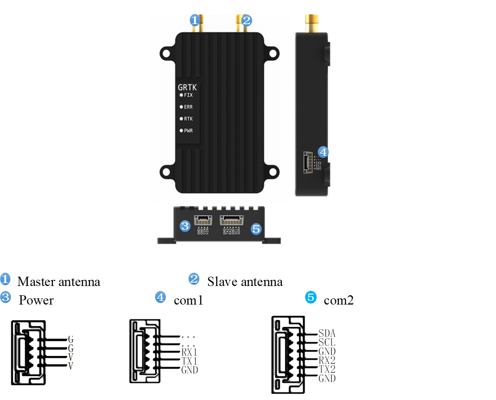
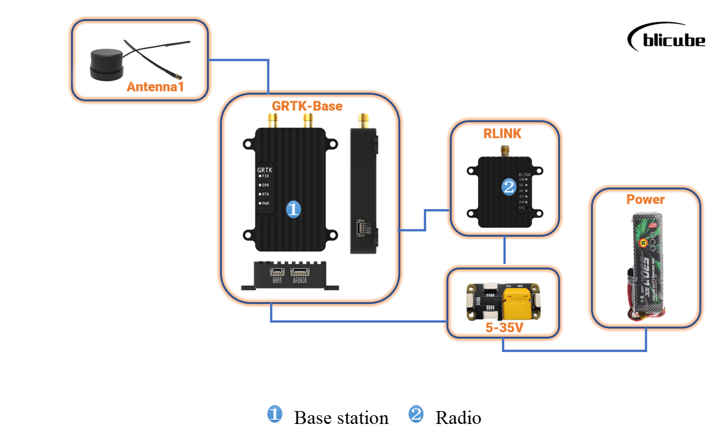
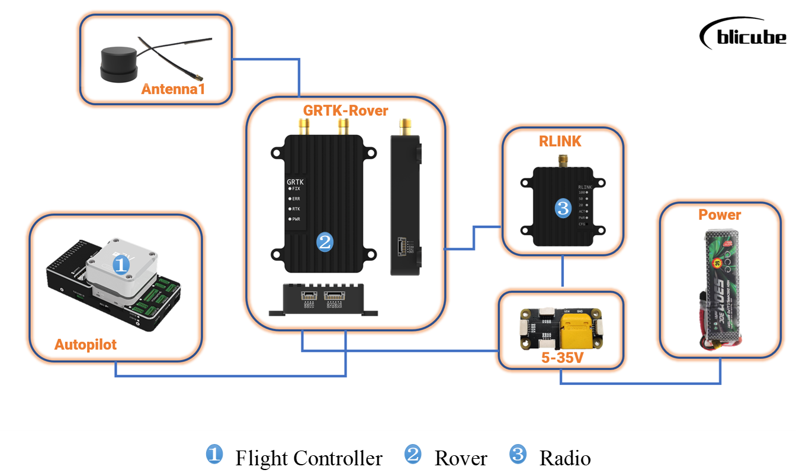
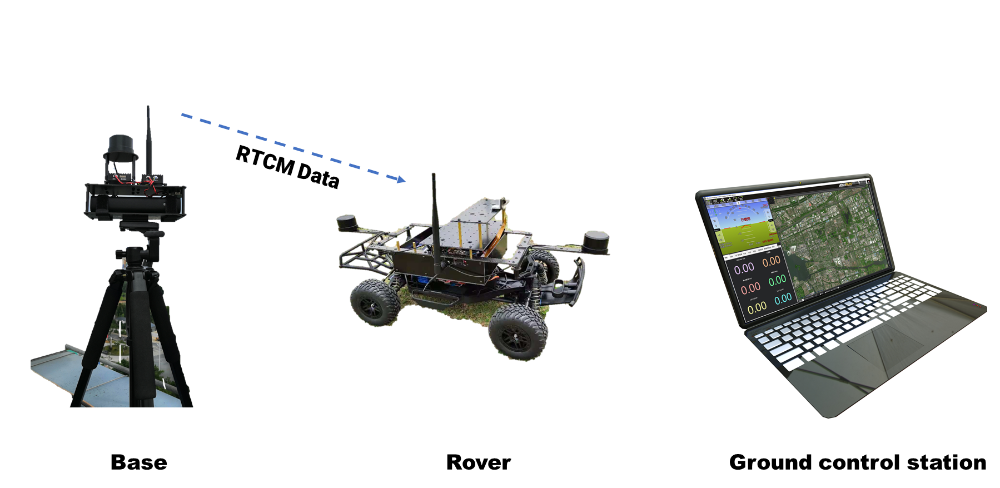
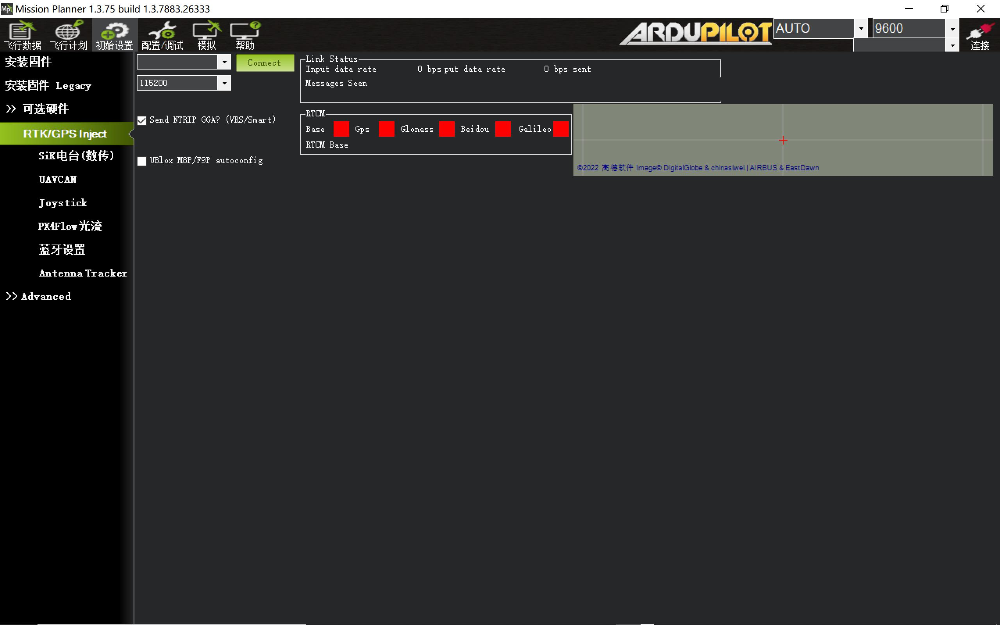
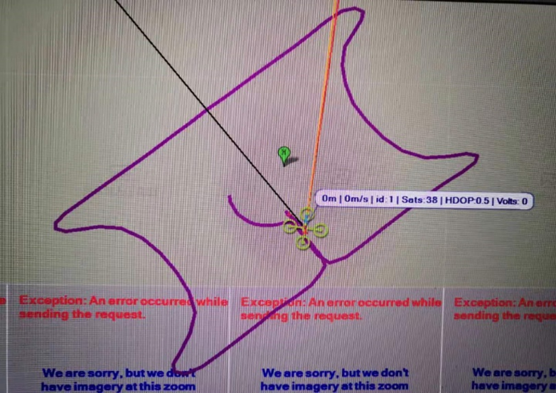
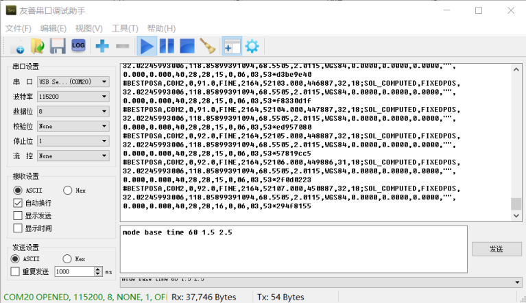
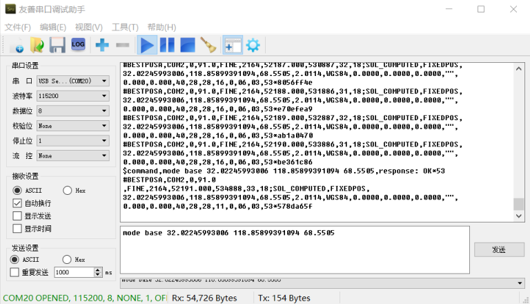
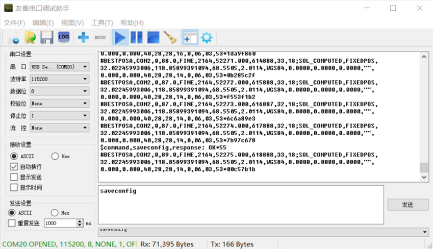

# GRTK用户手册

**版本**

| 版本号  | 日期         | 责任人  | 说明                                                                        |
|------|------------|------|---------------------------------------------------------------------------|
| V1.0 | 2021年5月4日  |      | 初始版本                                                                      |
| V2.0 | 2021年7月8日  |      | 修订了GRTK外壳图片                                                               |
| V3.0 | 2021年7月14日 |      | 新增基站多种工作模式                                                                |
| V3.1 | 2022年3月2日  | Alan | 增加通过地面站转发基站定位数据方法                                                         |
| V3.2 | 2022年4月5日  | Alan | 更新实物图、连接图等，与Ardupilot讨论后将配置输出速率统一为5Hz以足够飞控使用，同时可以防止多语句时115200波特率输出语句乱码的问题 |
| V3.3 | 2022年5月6日  | Alan | 更新配置命令适配Ardupilot V4.2.0或更高版本固件                                           |
| V4.0 | 2022年8月14日 | Alan | 增加内置罗盘使用说明                                                                |                                                                                                                              |

**关于本手册的声明**

用户使用GRTK厘米级定位模块，即视为自动接受本声明。

请用户在使用GRTK厘米级定位模块之前仔细阅读本手册，如有任何不明白的问题，请联系我们的技术支持邮箱[**info@blicube.com**](mailto:info@blicube.com)。

您可以通过加入[Discord](https://discord.com/invite/MNNby3fXz9) 参与我们产品的交流反馈。


## 1系统介绍

## 1.1系统简介

GRTK是blicube（北力电子）独立研发的双天线高精度差分定位定向模块（Real Time Kinematics），通过两个GRTK模块（一个移动端，一个基站端）可组成完整的RTK系统。

该模块基于新一代国产高性能GNSS SoC芯片设计，支持多系统多频点RTK定位，支持双天线高精度定向，支持北斗导航定位，支持内置罗盘以满足单天线时航向需求，主要面向无人机、机器人及智能驾驶等高精度定位定向需求。

<center>
{ width="300" }
</center>

<center>
图1.1 GRTK厘米级定位定向系统实物图
</center>


### 1.2技术参数

-   **性能指标**

| **项目**     |                                                                                    |
|------------|------------------------------------------------------------------------------------|
| 频点         | BDS B1I/B2I1<br/> GPS L1/L2<br/> GLONASS L1/L2<br/> Galileo E1/E5b<br/> QZSS L1/L2 |
| 协议         | NMEA-0183，RTCM                                                                     |
| 时间精度（RMS）  | 20ns                                                                               |
| 单点定位（RMS）  | 平面：1.5m <br/>高程：2.5m                                                               |
| DGPS (RMS) | 平面：0.4m <br/>高程：0.8m                                                               |
| RTK (RMS)  | 平面：1cm+1ppm <br/>高程：1.5cm+1ppm                                                     |
| 定向精度（RMS）  | 0.2度/1m基线                                                                          |
| 速度精度（RMS）  | 0.03m/s                                                                            |
| 工作温度       | -20℃到+85℃                                                                          |
| 工作电压       | 支持宽压输入：5v-35v                                                                      |
| 工作功耗       | 2.5W                                                                               |
 | 内置罗盘       | 支持                                                                                 |

-   **实物尺寸**

****

<div>
<center>
图1.2 实物尺寸示意图
</center>
</div>

## 2连接与使用

### 2.1接口定义

GRTK模块既可以作为基站也可以作为移动站使用，共有三个接口，如图2.1所示。分别是用于设备供电的Power口，用于移动站和基站通信的com1口以及用于与飞控通信传输定位信息的com2口，其中com2口包含串口2和串口3，默认使用串口2作为与飞控通信的串口。

****


<div>
<center>
图2.1 GRTK模块接口图
</center>
</div>


另外，模块正面还有四个led指示灯，左侧三个显示模块运行状态，分别是3D Fix定位状态、运行错误和RTK定位状态；右侧单独一个指示灯用于显示供电状态。

GRTK模块支持双天线测向，其中左天线为主天线，右天线为从天线，单天线使用需连接主天线。

GRTK默认使用TX2/RX2作为NMEA数据端口，TX1/RX1作为RTCM数据端口，SCL/SDA作为内置罗盘航向数据端口。

### 2.2 硬件连接

-   **基站（Base）端连线图**




<center>
图2.2基站连线图<br>
</center>


<center>
图2.3基站三脚架安装示例
</center>


-   **移动站（Rover）端连线图**




<center>
图2.3移动站端连线图
</center>

-   **双天线移动站（Rover）端连线图**


<center>
图2.4 双天线移动站端连线图
</center>

在不使用基站的时候，仅使用移动站也可以作为常规定位设备进行定位，接线如图2.3所示。

基站与移动站共同使用可组成RTK厘米级定位系统，基站支持即插即用。

移动站双天线测向需要将主从天线按照主后从前与航向保持一致，主从天线间距应大于30cm以保证测向精度。

* **内置罗盘的安装接线**

GRTK提供的内置罗盘航向参数是通过I2C传输给飞控等设备，使用时仅需将com2口的SCL和SDA与飞控I2C口进行正确连接即可。

内置罗盘航向如图所示，需要与飞控前进方向一致。


<center>
图2.5内置罗盘航向
</center>

### 2.3 指示灯&定位状态

GRTK模块上共有4个指示灯，具体含义如下表所示：

| **名称** | **状态** | **含义**                   |
|----------|----------|----------------------------|
| FIX      | 常亮     | 进入标准3D单点定位         |
|          | 不亮     | 未进入标准3D单点定位       |
| ERR      | 常亮     | 设备发生错误，不能正常工作 |
|          | 不亮     | 设备未发生错误，正常工作   |
| RTK      | 常亮     | 设备进入RTK固定解          |
|          | 不亮     | 设备未进入RTK固定解        |
| PWR      | 常亮     | 设备供电正常               |
|          | 不亮     | 设备供电异常               |

以一套GRTK（基站+移动站）为例，

- 基站正常工作状态灯如下：

<div>
<center>
POWER灯和FIX灯常亮，其他灯不亮；
</center>

- 移动站Fix工作时：
<center>
POWER灯和FIX灯常亮，其他灯不亮，移动站已进入标准3D单点定位；
</center>

- 移动站RTK工作时：
<center>
POWER灯、FIX灯、RTK灯常亮，其他灯不亮，移动站已进入RTK固定解。
</center>
</div>

### 2.4 定位数据说明

GRTK模块默认输出NMEA协议定位数据，连接USB转TTL与GRTK模块com2的Tx2与Rx2，可利用串口助手读取或者配置输出语句。GRTK移动站和基站在出厂时均已配置，**非专业人士请勿随意配置设备**，另外推荐使用友善串口助手设置 **换行为CR&LF** 再进行输出语句的换行。

#### 2.4.1 非双天线移动站

-   出厂默认以5Hz速率输出语句:


```html
GPGGA: Global positioning system fix data

GPRMC: Recommended minimum data

GPHDT: Output current heading information

KSXT: Time, positioning and heading of GNSS receiver
```

-   配置语句

    对于有其他语句信息需求的，可通过串口自行配置：

```html
1.  GPXXX COMX XX（语句+com口输出数据+语句输出速率）
2.  SAVECONFIG（保存设置）
```
-   重置命令

如在配置或者使用过程中发现输出语句与出厂时不一致，可通过以下命令进行重置输出：

```html
FRESET
GPGGA COM2 0.2  
GPRMC COM2 0.2  
GPHDT COM2 0.2  
KSXT COM2 0.2
SAVECONFIG
(PS：此处需要使用CR&LF换行)
```


#### 2.4.2双天线测向移动站

-   出厂默认以5Hz速率输出语句:

```html
GPGGA: Global positioning system fix data

GPRMC: Recommended minimum data

GPHDT: Output current heading information

KSXT: Time, positioning and heading of GNSS receiver
```

-   配置语句

    对于有其他语句信息需求的，可通过串口自行配置：

```html
1.  GPXXX COMX XX（语句+com口输出数据+语句输出速率）
2.  SAVECONFIG（保存设置）
```
-   重置命令

如在配置或者使用过程中发现输出语句与出厂时不一致，可通过以下命令进行重置输出：
```html
FRESET
GPGGA COM2 0.2  
GPRMC COM2 0.2  
GPHDT COM2 0.2  
KSXT COM2 0.2
SAVECONFIG
(PS：此处需要使用CR&LF换行)
```
### 2.5 常用配置命令

> FRESET 用于重置
> 
> 
> 
> 

## 3 使用教程

目前版本的GRTK厘米级定位系统，支持NMEA协议定位数据的输出，以下教程基于Ardupilot固件采用Mission Planner地面站进行操作说明。

### 3.1设备接线

-   请在接线前准备好如图3.1所示的硬件用于连接：



<center>
图3.1 硬件实物图
</center>

-   GRTK可以通过基站与移动站间通过独立链路通信或者地面站转发基站数据的两种方式实现RTK定位<br>
1. 独立链路方式下：<br>
   a.请将GRTK Rover的com2口（TX2 RX2）连接到pixhawk的GPS口，com1口（TX1 RX1）连接与Base端通信的数传设备。<br>
   b.请将GRTK Base进行天线连接和供电，并将com1口连接与Rover端通信的数传设备。<br>
2. 地面站转发基站数据方式下：<br>
   a.请将GRTK Rover的com2口（TX2 RX2）连接到pixhawk的GPS口；<br>
   b.请将GRTK Base 上电，并将其com1口（TX1 RX1）与电脑进行串口连接；<br>
   c.打开Mission Planner地面站，找到**初始设置**处的**可选硬件**，选择**RTK/GPS Inject**；<br>



   d.选择正确的com口，并点击**Connect；**<br>


   e.等待大约一分钟Base完成基站定位，此时**RTCM**栏中的红色都变为绿色，且显示当前基站的经纬度信息，即已实现地面站转发Base定位数据。<br>


-   移动站、基站和数传需单独供电。

### 3.2 Mission Planner的设置

#### 3.2.1 RTK设置

GRTK Base支持即插即用，不需要在地面站进行额外的设置。但在实际使用RTK之前，需要先在MP中对飞控进行参数设置，下面给出必须的参数设置（适配Ardupilot固件V4.2.0及以上版本），具体可参考：

```html
https://ardupilot.org/copter/docs/common-gps-for-yaw.html
```

1、配置GPS协议为NMEA，并将GPS数据刷新速率设置为5Hz（默认值）

参数列表：

-   **GPS_TYPE 5** 设置为NMEA输入
-   **GPS_RATE_MS** 设置为200ms，频率为5Hz

2、使用双天线测向需启用GPS航向

参数列表：

-   **EK3_SRC1_YAW**设置为2，使用GPS提供航向

如需关闭罗盘：

-   **COMPASS_ENABLE** 设置为0

#### 3.2.2 GRTK内置罗盘设置

1、 如果已经通过I2C正确连接GRTK SCL SDA 与 飞控的I2C端口，可以在地面站中查询到extra compass. 


2、 设置此罗盘为飞控的外置罗盘


3、 如果仅想使用此罗盘，可以disable其他罗盘，并enable此罗盘


### 3.3 RTK定位实测

1、移动站篮球场框线绘制效果实测




<center>
图3.4 RTK实测效果图
</center>


2、无人车自动航线任务实测


<center>
图3.5 RTK自动航线任务效果图
</center>


## 4 基站两种工作模式

GRTK基站有两种工作模式，为自主优化设置基站模式和固定基站模式。自主优化设置基站：即在将架设基站的点没有精确坐标。可设置基站在安装点上进行一定时间内自定位取平均值，设置为基站的坐标。固定基站：即在将架设基站的点有精确坐标。需要将基站的精确坐标输入基站。

### 4.1自主优化设置基站模式配置

GRTK基站默认工作模式是自主优化设置基站模式。配置方法如下：使用USB转TTL模块将基站的串口2连接到电脑，电脑运行串口调试助手，打开对应的串口，波特率为115200。基站返回当前的位置信息。


将如下的命令(注意命令需要以换行符结尾)通过串口发送给基站，完成配置。

```html
mode base time 60 1.5 2.5
```



命令解释：基站自主定位60秒；或者水平定位标准差\<=1.5m，且高程定位标准差\<=2.5m时，把水平定位的平均值和高程定位的平均值作为基站坐标值。用户可以根据自己的需求修改参数。

配置完成后，将如下的命令(注意命令需要以换行符结尾)通过串口发送给基站，保存配置。
```html
saveconfig
```


### 4.2固定基站模式配置

**固定基站模式配置分为两步，第一步获取当前的精确坐标，第二步将基站的精确坐标输入基站。**

**第一步 获取当前的精确坐标**

使用USB转TTL模块将基站的串口2连接到电脑，电脑运行串口调试助手，打开对应的串口，波特率为115200。基站返回当前的位置信息。


将如下的命令(注意命令需要以换行符结尾)通过串口发送给基站。

```html
mode base time 60 1.5 2.5
```


命令解释：基站自主定位60秒；或者水平定位标准差\<=1.5m，且高程定位标准差\<=2.5m时，把水平定位的平均值和高程定位的平均值作为基准站坐标值。用户可以根据自己的需求修改参数。

观察获取到的WGS84坐标，当坐标稳定时，表示基站初始化完成。


复制基站输出的位置信息如下

```html
#BESTPOSA,COM2,0,91.0,FINE,2164,52077.000,420887,32,18;SOL_COMPUTED,FIXEDPOS,32.02245993006,118.85899391094,68.5505,2.0115,WGS84,0.0000,0.0000,0.0000,"",0.000,0.000,40,28,28,16,0,06,03,53\*17b29c25
```

获取经度纬度和高程数据如下

```html
32.02245993006,118.85899391094,68.5505（这是示例数据，请根据实际测量数据进行替换）
```

**第二步 将基站的精确坐标输入基站**

根据基站的精确坐标生成配置命令

```html
mode base 32.02245993006 118.85899391094 68.5505
```

将配置命令(注意命令需要以换行符结尾)通过串口发送给基站。



配置完成后，将如下的命令(注意命令需要以换行符结尾)通过串口发送给基站，保存配置。

```html
saveconfig
```



## 5 注意事项

1、使用本公司RTK套装，基站端支持即插即用，如果仅购买了移动端，使用其他公司的基站端需要在地面站进行额外的RTK基站端配置，无法保证兼容性和定位精度。

2、本产品为定位设备，需要搜索卫星定位，使用时应尽量在空旷无干扰的场地测试。

3、RTK的定位状态需以地面站显示为主。

## 6 GRTK购买

1. 购买地址

淘宝店铺：[北力电子](https://shop110478222.taobao.com/shop/view_shop.htm?spm=a1z0d.6639537.1997196601.1.8edb7484sy6lAh&user_number_id=1956268583)

2. 发货清单

| **基站安装架** |      |      |
|----------------|------|------|
| 名称           | 数量 | 单位 |
| 底板           | 1    | 块   |
| 盖板           | 1    | 块   |
| 天线底板       | 1    | 块   |
| 45mm铝柱M3     | 8    | 根   |
| 8mm铝柱M3      | 12   | 根   |
| M3x5螺钉       | 45   | 个   |
| 三脚架快拆铝板 | 1    | 块   |

| **GRTK模块** |                                         |      |     |
|------------|-----------------------------------------|------|-----|
| 名称         | 型号                                    | 数量 | 单位  |
| GRTK       | BASE                                    | 1    | 个   |
| GRTK       | ROVER                                   | 1    | 个   |
| 多星多频GNSS天线 | BL-320                                  | 3    | 个   |
| 配线包        | 标准                                    | 2    | 包   |


3. 物流

本店国内默认顺丰包邮，国外客户需根据实际情况采取合适的物流方式。

4. 关于批发

根据批发数量的不同，批发价格不等，有批发需求请联系客服。

5. 视频

- 绕操场全程，厘米级压线精度：

<center>
<iframe width="560" height="315" src="//player.bilibili.com/player.html?aid=503701172&bvid=BV1Bg411g7Sy&cid=355302335&page=1" scrolling="no" border="0" frameborder="no" framespacing="0" allowfullscreen="true"> </iframe>
</center>

- GRTK30s快速部署基站：

<center>
<iframe width="560" height="315" src="//player.bilibili.com/player.html?aid=546142968&bvid=BV1Kq4y1L7W8&cid=355912464&page=1" scrolling="no" border="0" frameborder="no" framespacing="0" allowfullscreen="true"> </iframe>
</center>

- GRTK静止精度&无人机光绘：

<center>
<iframe width="560" height="315" src="//player.bilibili.com/player.html?aid=418193394&bvid=BV1iV411j7M8&cid=341768300&page=1" scrolling="no" border="0" frameborder="no" framespacing="0" allowfullscreen="true"> </iframe>
</center>