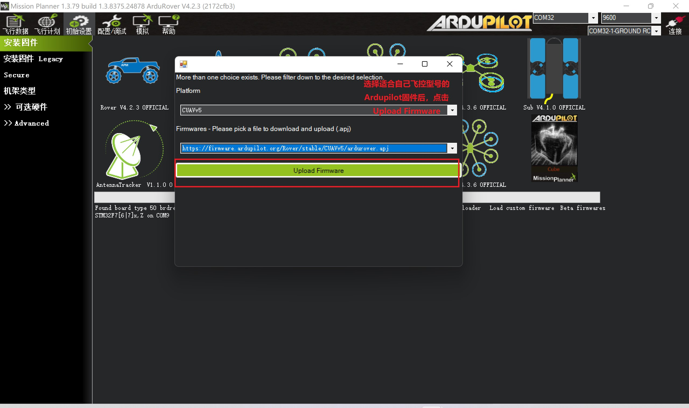

# 高精度自动驾驶套装的使用

## 套装主要设备

{ width="1000" }

## Pixhawk飞控

!!! Note "Pixhawk飞控"
    Pixhawk是一种开源飞控硬件平台，主要用于多旋翼、固定翼等无人机的控制。

Misson Planner简称MP，是Windows 平台运行的一款APM/PIX的专属地面站。它也是一款完全开放源码的地面站

它主要功能包括：

* 对APM/PIX进行烧录固件
* 安装、配置和优化参数
* 规划航点任务，可以使用google地图或者其它地图
* 下载和分析飞行日志
* 使用专用的PC飞行模拟软件接口，进行硬件模拟飞行
* 连接一个遥测数传，你还可以：
* 实时监控飞行器状态
* 记录一个实时遥测日志
* 查看和分析遥测日志
* 在FPV中操作无人机（第一人称视角)

# Pixhawk 与 GRTK、RLINK的连线

!!! Note "移动端连线"
    此处设备需连接好后置于自动驾驶设备处
    注意使用过程中，天线不要遮挡

{ width="1000" }

## 准备工作

### 软件安装

* 串口助手驱动安装: [Serial Port Utility](https://www.alithon.com/downloads)
* 地面站软件：[Mission Planner](https://ardupilot.org/planner/docs/mission-planner-installation.html) / [QGroundControl](http://qgroundcontrol.com/downloads/)

### Pixhawk飞控调试

!!!Note "Pixhawk飞控"
    这里以Pixhawk 6C来演示

#### 通过usb-typec与电脑连接，并打开Mission Planner，点击`初始配置`后选择`安装固件`，点击想要升级无人车/无人机/无人船等

{ width="1000" }

**选择与自己pixhawk型号相匹配的固件型号进行upload**

{ width="1000" }

#### 固件升级完成后，选择正确的**com口**，波特率选择**9600**，点击**连接**

{ width="1000" }

**连接完成**

{ width="1000" }

#### 通过`配置/调试`,选择`全部参数表`,点击`加载`,加载自定义的参数表（针对GRTK/RLINK适配的参数表可参考[pixhawk6c-rover-param]())，无参数表的可以跳过这步

{ width="1000" }

#### 必要硬件校准

* **加速度计校准**

点击`校准加速度计`，将控制器按照提示将每个面与桌面平齐放置，待提示成功后 换面继续 直至六个面全部校准完成

{ width="1000" }

* **水平仪校准**

将控制器水平放置后点击`校准水平`,等待提示完成

{ width="1000" }

* **指南针校准**

点击`Start`开始校准罗盘，需要将控制器沿360°每个方向进行旋转，待右侧显示100%后，校准完成

{ width="1000" }

* **遥控器校准**

需要提前将接收机通过sbus与飞控连接后，遥控器开机，点击校准遥控器后，拨动所有摇杆覆盖所有范围，待全部摇杆的最大最小值都被捕获后，点击校准完成

{ width="1000" }

{ width="1000" }

#### 飞控解锁

我们提供的参数表中默认将`通道6`设为 `解锁/上锁` 通道

当然你也可以通过这种方式根据`选项`中的提示,将其他通道设定为特定功能。

{ width="1000" }

## Pixhawk飞控的使用方法：

* 硬件连接：将Pixhawk飞控和其他硬件（电机、电调、遥控器等）进行连接，确保连接正确并检查无误。

* 安装固件：将Pixhawk飞控与计算机连接，使用开发者提供的Mission Planner或QGroundControl软件，选择合适的固件并进行安装。确保固件的版本和飞行器型号匹配，避免出现不兼容问题。

* 参数配置：在Mission Planner或QGroundControl软件中进行参数配置，包括飞行器类型、电机数量、电调类型等。可以根据实际需求进行个性化设置，如PID参数、传感器校准等。

* 飞行模式选择：选择适合当前飞行任务的飞行模式，例如手动模式、定高模式、定点模式等。确保在起飞前设置好飞行模式并进行检查。

* 飞行前检查：在起飞前对飞行器进行检查，包括电池电量、传感器状态、GPS信号强度等。确保飞行器正常工作，并且没有故障或者损坏。

* 起飞和飞行：起飞前进行安全检查，确保飞行器周围没有人和障碍物，以及飞行条件是否适宜。启动飞行器，进行起飞，并根据需要进行飞行操作。在飞行过程中，根据实际情况及时调整参数，确保飞行器稳定并保持飞行安全。

* 降落和着陆：飞行结束后，根据实际情况选择适当的降落方式，如自动降落或手动降落。在飞行器降落或着陆前，确保周围环境安全，避免意外发生。

!!! Warning "注意" 
    飞行器的操作需要有一定的飞行经验和技术储备。在飞行前，一定要进行充分的飞行器检查和周围环境检查，确保安全飞行。
