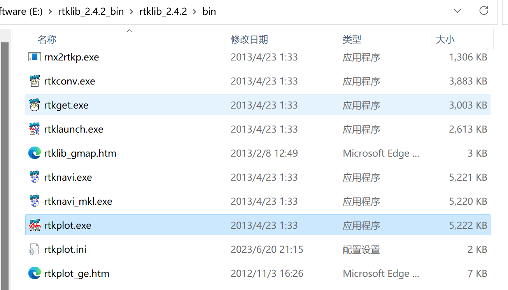
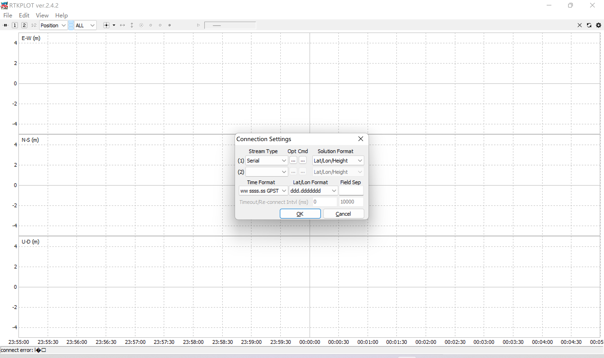
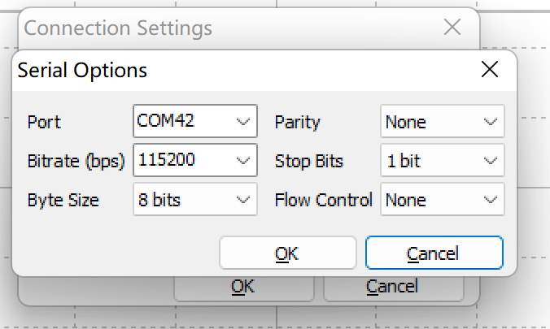
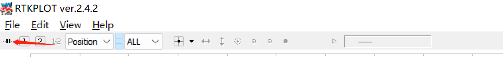
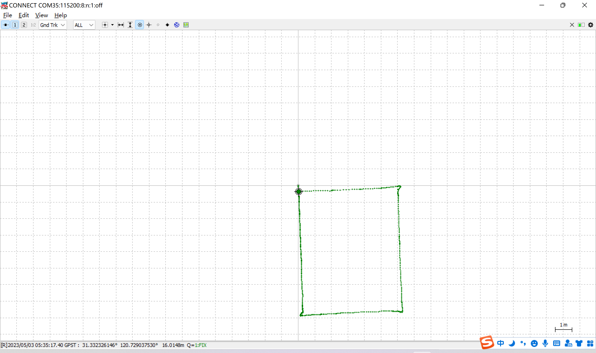
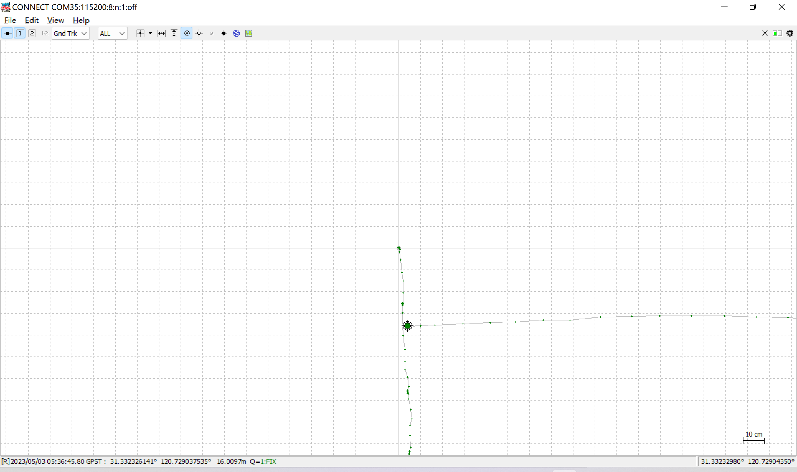

# RTK上位机如何解析GRTK移动站定位数据

!!!Note "rtklib"
    rtklib是一个被广泛使用的开源定位数据解析软件，可以帮助用户轻松解析包括NMEA/ubx等定位数据，
    并提供UI界面帮助对定位信息进行高效分析
    [官方教程](https://rtklib.com/rtklib_tutorial.htm) 

## 下载

!!!Info "[rtklib](https://rtklib.com/)"
    下载完成后无需安装解压本地即可使用
    

## rtklib使用入门

### 打开rtkplot.exe

{ width="500" }

### Connection Settings

!!!Info "Connection Settings"
    `File`——>`Connection Settings`
    Stream Type选择`Serial`,通过串口收发数据

{ width="500" }

!!!Info "点击`Opt`"
    配置串口具体参数
    选择正确的串口， 波特率 115200 

{ width="200" }

### 连接GRTK并开始解析数据

{ width="500" }

## 保存数据

## 解析GRTK定位数据实例

!!!Note "定位精度实验"
    GRTK Rover 需进入 `RTK fixed` 状态
    定位数据通过`RLINK`时时回传到电脑端进行解析

### 通过GRTK描绘方格

!!!Note "GRTK移动"
    GRTK Rover端人为搬动沿矩形区域走动，
    注意移动时不能遮挡天线

**效果图:**

{ width="500" }

**放大图：**

{ width="500" }