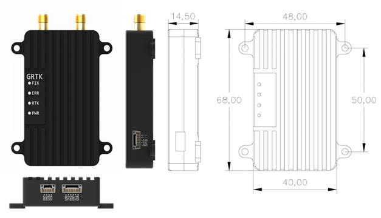

# GRTK Introduction

**GRTK**是[北力电子](https://www.blicube.com/)自主研发的一款高精度定位定向模块。 

基于**和芯星通**的高性能**GNSS SOC**，**GRTK**能够在支持**多频点（GPS/GLONASS/Beidou/Galileo/QZSS）高精度定位**的同时，实现**单模块双天线定向**。 
目前已被广泛应用于无人车、无人机、无人船等智能驾驶领域。

请用户在使用GRTK厘米级定位模块之前仔细阅读本手册，如有任何不明白的问题，请联系我们的技术支持邮箱[**info@blicube.com**](mailto:info@blicube.com)。 

您可以通过加入[Discord](https://discord.com/invite/MNNby3fXz9) 参与我们产品的交流反馈。

{ width="300" }

<iframe width="560" height="315" src="https://www.youtube.com/embed/Gq83rHsXRVo" title="YouTube video player" frameborder="0" allow="accelerometer; autoplay; clipboard-write; encrypted-media; gyroscope; picture-in-picture" allowfullscreen></iframe>

## Performance

| **项目**     |                                                                   |
|------------|-------------------------------------------------------------------|
| 频点         | BDS B1I/B2I1   GPS L1/L2  GLONASS L1/L2   Galileo E1/E5b   QZSS L1/L2 |
| 协议         | NMEA-0183  RTCM                                                    |
| 时间精度（RMS）  | 20ns                                                              |
| 单点定位（RMS）  | 平面：1.5m   高程：2.5m                                                  |
| DGPS (RMS) | 平面：0.4m   高程：0.8m                                                  |
| RTK (RMS)  | 平面：1cm+1ppm   高程：1.5cm+1ppm                                        |
| 定向精度（RMS）  | 0.2度/1m基线                                                         |
| 速度精度（RMS）  | 0.03m/s                                                           |
| 工作温度       | -20℃到+85℃                                                         |
| 工作电压       | 支持宽压输入：5v-35v                                                     |
| 工作功耗       | 2.5W                                                              |
 | 内置罗盘       | 支持                                                                |

## Physical size

{ width="500" }

## Test Video

-   无人车自动压线导航测试

<iframe width="560" height="315" src="https://www.youtube.com/embed/vlFBtBZZLb4" title="YouTube video player" frameborder="0" allow="accelerometer; autoplay; clipboard-write; encrypted-media; gyroscope; picture-in-picture" allowfullscreen></iframe>

