# 快速上手

!!! info "GRTK支持NMEA与RTCM协议"
    目前新版本Ardupilot和PX4均已支持NMEA，请更新最新版本固件配合GRTK使用

## 接口和配件说明


### 接口定义

!!! info "[GRTK接口定义](https://wiki.blicube.com/grtk/zh/GRTK%E7%94%A8%E6%88%B7%E6%89%8B%E5%86%8C/#21)"
    GRTK默认以115200波特率，通过UART串口进行数据通信

### 配线说明

!!! info 
    每个GRTK模块默认配一包线

[套装](https://wiki.blicube.com/grtk/zh/GRTK%E7%94%A8%E6%88%B7%E6%89%8B%E5%86%8C/#6-grtk)示意图如下：

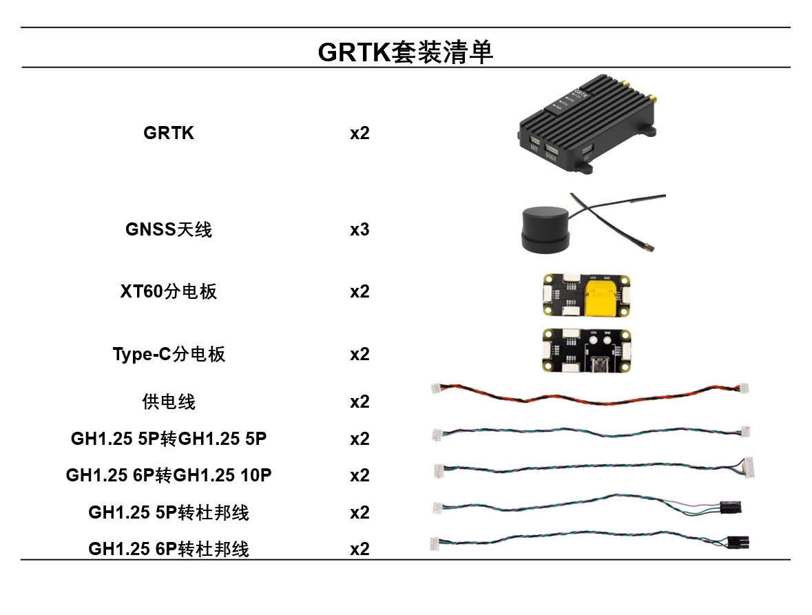{ align=center }

配线包内容：

|          名称          |  数量   |                 功能                  |
|:--------------------:|:-----:|:-----------------------------------:|
| GH1.25 5P转GH1.25 5P  |   1   |           用于COM1与RLINK连接            |
| GH1.25 6P转GH1.25 10P |   1   |         用于COM2与10P 飞控GPS口连接         |
|    GH1.25 6P转杜邦线     |   1   | 用于COM2口与电脑进行串口通信，对GRTK进行配置或读取NMEA数据 |
|         供电线          |1|             用于供电口与分电板连接             |

### 分电板说明

!!! info "5V-35V宽压输入"
    GRTK支持5V-35V宽压电源，因此使用过程中无论是充电宝还是2-8S锂电池均能够为GRTK供电
    功率请限制在5-10w

!!! Warning "产品使用前请先确认好供电设备是否正常工作"
    注意供电电源需要能够稳定提供5W以上功率，避免因供电不足导致设备不能正常工作。
    大部分的超薄笔记本并不能通过USB口直接供电使用。
    部分充电宝或者手机电源适配器会去握手充电协议，是不能够进行充电的
    使用锂电池需注意使用稳压模块来接GRTK，避免因锂电池高功率直接烧毁设备


* XT60分电板 

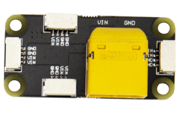{ width="200" }

* Type-C分电板

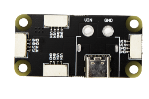{ width="250" }


## 到手检查

!!! Warning
    我们强烈建议您到手后先进行设备检查，确认供电和配置无问题后再连接飞控或其他设备使用

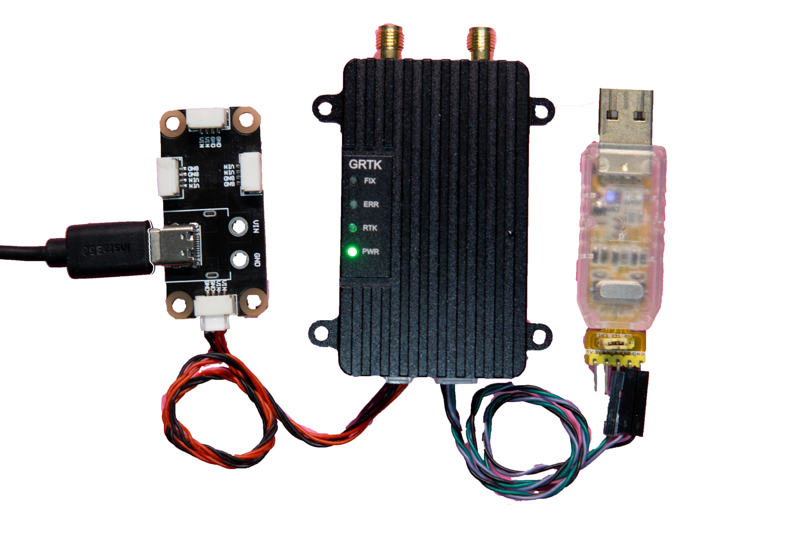{ width="600" }

1.通过分电板为设备供电

GRTK通电瞬间**指示灯全亮**，之后保持```PWR```灯亮起；

如遇```ERR```灯常亮，排除供电问题后仍常亮，请联系客服进行处理。

2.Rover需要将**com2**口通过```USB转TTL模块```连接电脑

串口助手设置**115200波特率**和**ASCII**接收后，如果能得到下面的数据输出即为正常。

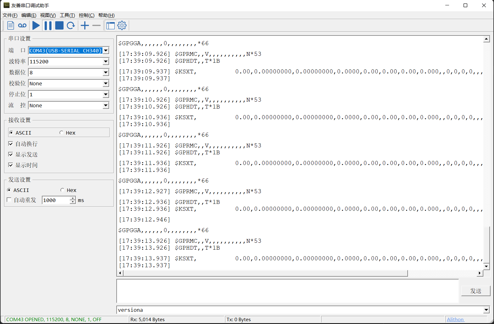{ align=center,width="500" }

在能够正常收星的室外，`Fix`灯将亮起，代表已经进入单点定位，此时定位精度为亚米级。


3.Base需要将**com2**口通过```USB转TTL模块```连接电脑

!!! Warning "Base在无定位的情况下不会输出RTCM纠偏数据"

串口助手设置**115200波特率**和**ASCII**接收后，如果能得到下面的数据输出即为正常。

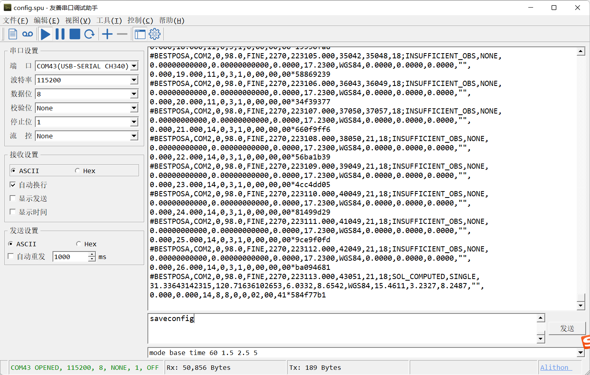{ align=center,width="500" }

待`Fix`亮起后，将Base的**com1**口通过```USB转TTL模块```连接电脑，

串口助手设置**115200波特率**和**HEX**接收后，如果能得到下面的数据输出即为正常。

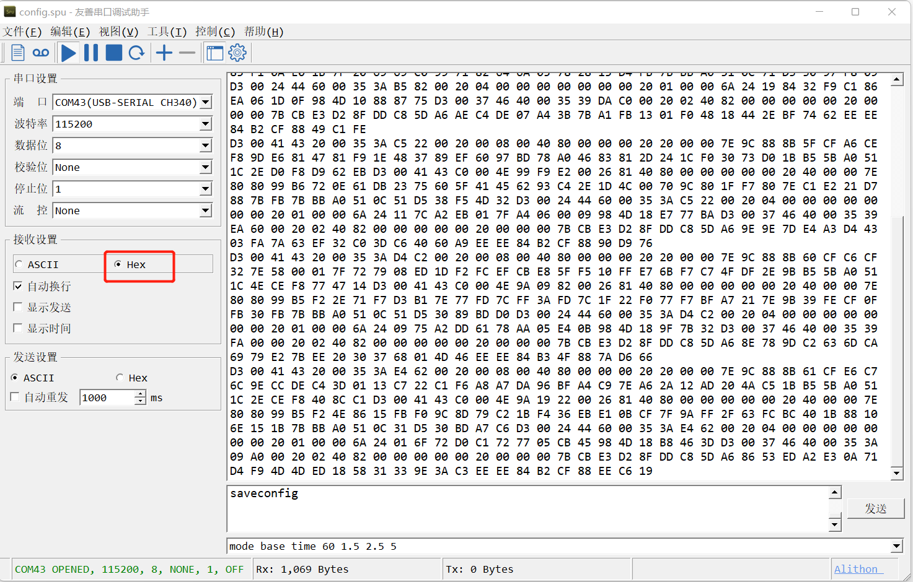{ align=center,width="500" }

## 还原出厂设置

!!! Warning "当遇到配置问题需要还原出厂设置"
    更详细的配置命令可以参考 [常用配置命令](%E5%B8%B8%E7%94%A8%E9%85%8D%E7%BD%AE%E5%91%BD%E4%BB%A4.md)

!!! Note "请**务必**调整串口助手发送以**CR&LF**结尾"
    发送配置命令请注意加换行后再发送

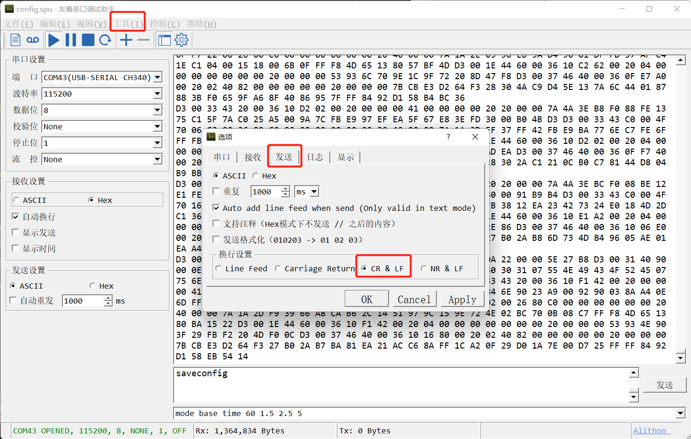{ align=center,width="500" }

!!! Note "Freset"
    先以**freset**来还原出厂

```
freset
(加回车换行)
```
> 配置成功后会有`OK`返回

```
$command,freset,response: OK*4D
System should reset after Come to factory mode .......
$devicename,COM2*64
```

!!! Note "Rover"
    我们推荐按以下命令恢复为出厂移动站配置

```
GPGGA COM2 0.2  
GPRMC COM2 0.2  
GPHDT COM2 0.2  
KSXT COM2 0.2
SAVECONFIG
(加回车换行)
```
> 配置成功后会有`OK`返回

```
$command,GPGGA COM2 0.2  ,response: OK*57
$command,GPRMC COM2 0.2  ,response: OK*4A
$command,GPHDT COM2 0.2  ,response: OK*4E
$command,KSXT COM2 0.2,response: OK*15
$command,SAVECONFIG,response: OK*55
```

!!! Note "Base"
    我们推荐按以下命令恢复为出厂基站配置
  
```
mode base time 60 1.5 2.5
rtcm1006 com1 10
rtcm1033 com1 10
rtcm1074 com1 1
rtcm1084 com1 1
rtcm1094 com1 1
rtcm1124 com1 1
LOG COM2 BESTPOSA ONTIME 1
saveconfig
(加回车换行)
```
> 配置成功后会有`OK`返回

```
$command,mode base time 60 1.5 2.5,response: OK*78
$command,rtcm1033 com1 10,response: OK*06
$command,rtcm1074 com1 1,response: OK*35
$command,rtcm1084 com1 1,response: OK*3A
$command,rtcm1094 com1 1,response: OK*3B
$command,rtcm1124 com1 1,response: OK*31
$command,LOG COM2 BESTPOSA ONTIME 1,response: OK*41
$command,saveconfig,response: OK*55
```

### 硬件连接

!!! Info "GRTK移动端"
    GRTK移动端又称Rover端，需**安装在需要定位的设备**上，通过```NMEA语句```来直接提供高精度定位信息的模块。

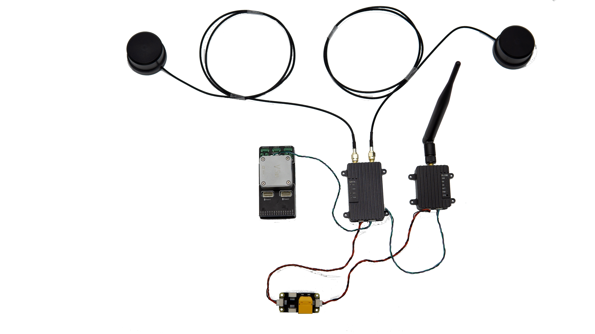{ width="1000" }

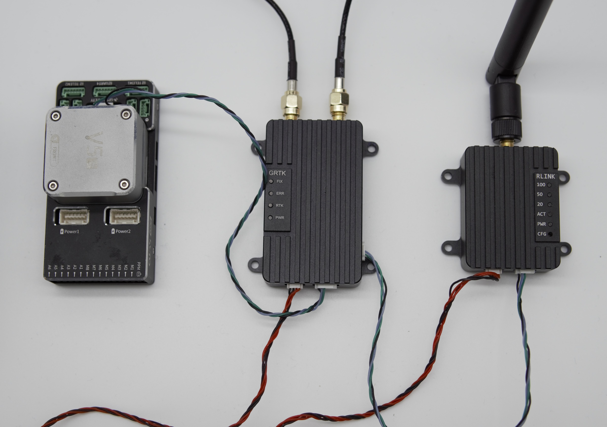{ width="1000" }

!!! Info "GRTK基站端"
    GRTK基站端又称Base端，需安装在固定位置，通过传输```RTCM数据```给GRTK Rover端以使其进入RTK Fixed
    的状态。

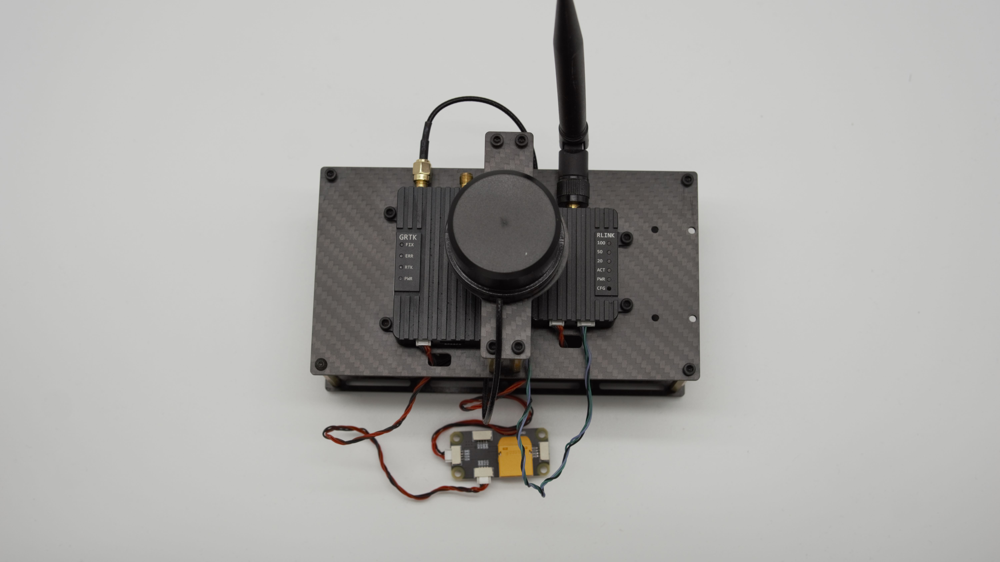{ width="500" }

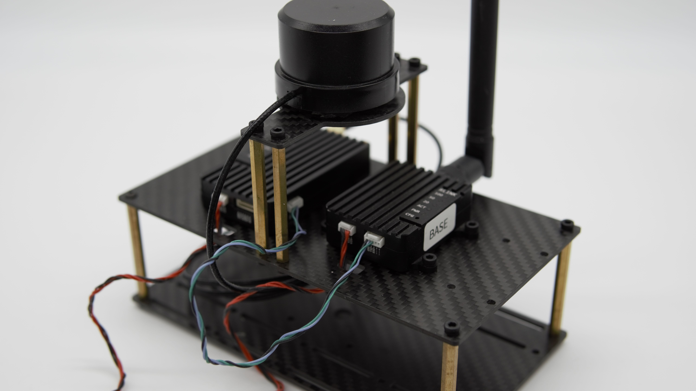{ width="500" }

!!! Info "套装全貌"

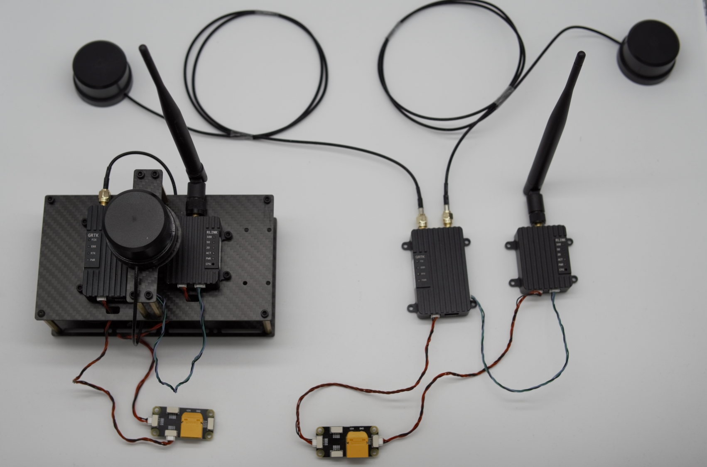{ width="1000" }


### Ardupilot固件的配置

!!! Info "[Ardupilot自动驾驶小车官方教程](https://ardupilot.org/rover/index.html)"

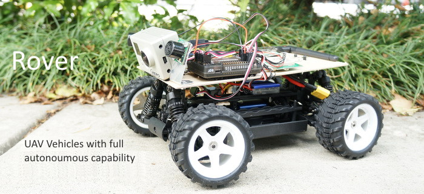{ width="1000" }

!!! Warning
    建议搭配4.3.0及以上版本Ardupilot固件使用
    请至少使用4.2.0及以上版本


!!! Note "最新的Ardupilot固件已经默认使用EK3"

-   **GPS_TYPE 5** 设置为NMEA输入
-   **EK3_SRC1_YAW**设置为2，使用GPS提供航向

### Mission Planner 地面站

!!! Info "[Mission Planner官方教程](https://ardupilot.org/planner/docs/mission-planner-overview.html)"

!!! Info "[Mission Planner官方下载](https://firmware.ardupilot.org/Tools/MissionPlanner/MissionPlanner-latest.msi)"


### PX4固件的配置

!!! Info "[PX4官网]()"
    双天线定向请使用 PX4 1.14及以后版本

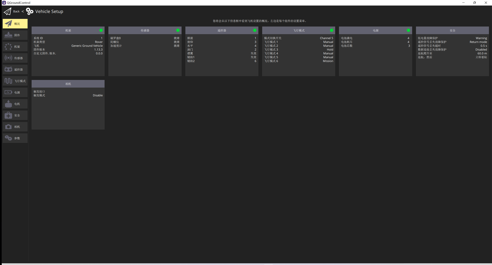{ width="1000" }

!!! Info "更改GPS参数"
    Protocol 选择 NMEA
    GNSS System 可根据特定需要选择，全选为 31

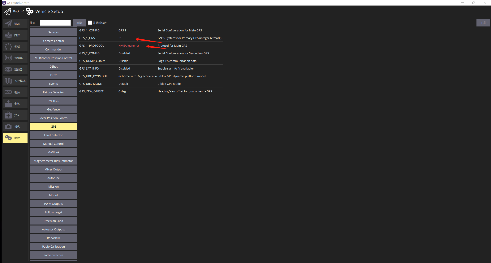{ width="1000" }

## 自动驾驶

!!! Info "中断任务后继续任务"
    例：Auto mode -> Hold mode -> Auto mode 可继续之前未完成的任务